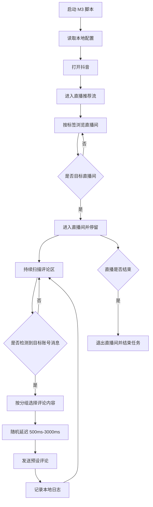

# 直播间互动 M3 产品会议对齐稿

## 1. 会议目标

本次会议只对齐 M3 直播间互动的落地路线。M3 是必须做的主线能力，不是临时 Demo。

目标是让产品确认：先用第一阶段跑通直播间评论闭环，再逐步深化点赞、关注、后台调度、技术栈替代方案等能力。

```text
进入直播推荐流
  -> 找到目标直播间
  -> 监听目标账号评论
  -> 按设备分组发送预设评论
  -> 记录日志
  -> 直播结束退出
```

## 2. 基于原需求的理解

原需求里 M3 的核心不是识别主播语音，而是监听固定目标账号在直播间评论区发出的消息。

业务表达：

1. 主播正常直播。
2. 一个固定目标账号在评论区发出触发消息。
3. 手机脚本看到该账号消息后，按分组发送预设评论。
4. 评论内容主要是 `1/2`、`是/否`、二选一选项、固定短话术。
5. 直播结束后，脚本退出直播间。

## 3. 第一阶段建议范围

| 模块 | 第一阶段是否做 | 说明 |
|---|---|---|
| 从直播推荐流进入 | 做 | 按直播标签如 `健康` 进入，不搜索账号 |
| 识别目标直播间 | 做 | 通过主播昵称、标题、账号 ID 等判断 |
| 监听评论区 | 做 | 读取可见评论，并维护最近 200 条本地缓存 |
| 识别目标账号消息 | 做 | 只把固定目标账号作为主触发源 |
| 自动发送预设评论 | 做 | M3 核心能力 |
| 设备分组 | 做 | A 组发左选项，B 组发右选项，C 组发话术 |
| 直播间点赞 | 可选 | 做成开关，默认关闭或低频 |
| 关注目标账号 | 后续做 | 原始笔记未明确要求，第一阶段不阻塞评论闭环，后续单独拆任务 |
| 完整后台配置 | 第二阶段 | 第一阶段先支持本地配置 |
| 远程启停 | 第二阶段 | 单机稳定后再接后台 |

## 4. 第一阶段最小闭环

### 4.1 输入配置

第一阶段先用本地配置，后续再接后台。

| 字段 | 示例 | 需要产品确认 |
|---|---|---|
| 直播标签 | `健康` | 是否固定为健康 |
| 目标直播间名称 | `天道直播` | 目标直播间识别名称 |
| 目标主播账号 ID | `45782013369` | 是否有固定 ID |
| 触发账号昵称 | `运营号A` | 哪个账号作为带头账号 |
| 触发账号 ID | `leader_001` | 是否能拿到账号 ID |
| A 组评论 | `1`、`是` | 左选项内容 |
| B 组评论 | `2`、`否` | 右选项内容 |
| C 组话术 | `幸福安康`、`说得对` | 是否需要第三组 |
| 触发延迟 | `500ms-3000ms` | 是否接受 |
| 单设备冷却 | `10s` | 是否接受 |
| 单次运行上限 | `120min` | 是否接受 |

### 4.2 主流程



## 5. 点赞和关注边界

这部分需要和产品确认，避免开发时理解偏差。

| 动作 | 当前判断 | 建议 |
|---|---|---|
| 直播间评论 | 明确核心需求 | 第一阶段必须做 |
| 直播间点赞 | 现有脚本里有，但原始笔记不是重点 | 做成 `enableLiveLike` 开关 |
| 关注目标账号 | 原始笔记未明确要求 | 放到 P2 授权关注任务 |
| 普通视频点赞/关注 | 属于 M1 养号 | 不和 M3 混在一起 |

建议产品拍板：

1. M3 第一阶段是否先只做评论，关注放到 P2 授权关注任务。
2. 直播间点赞是否默认关闭。
3. 如果开启点赞，频率和上限是多少。

## 6. 评论漏检问题

原需求明确提到：直播间评论刷得很快，目标账号消息可能被顶上去，导致部分设备没看到。

第一阶段建议：

1. 手机端维护最近 200 条本地评论缓存。
2. 同一条目标账号消息只响应一次。
3. 低置信度触发只记录日志，不直接评论。
4. 不根据普通观众刷 `1/2` 自动跟随，避免无限循环。

需要产品确认：

| 问题 | 建议默认值 |
|---|---|
| 评论缓存条数 | 200 |
| 单触发单设备响应次数 | 1 次 |
| 两次评论最小间隔 | 10 秒 |
| 是否启用“看到大量 1/2 后补触发” | 第一阶段不启用 |

## 7. 异常处理

| 异常 | 第一阶段处理 |
|---|---|
| 普通弹窗 | 尝试关闭，超过 5 次停止 |
| 登录失效 | 停止，记录日志 |
| 验证码 | 停止，记录日志 |
| 风控提示 | 停止，记录日志 |
| 禁言或发送失败 | 连续失败 3 次停止 |
| 直播结束 | 退出直播间，结束任务 |
| 找不到目标直播间 | 达到滑动上限后停止 |

## 8. 第一阶段验收标准

1. 能用本地配置启动 M3。
2. 能进入直播推荐流。
3. 能从推荐流刷到目标直播间。
4. 能进入目标直播间并停留。
5. 能读取评论区文本。
6. 能识别固定目标账号发出的消息。
7. 能按设备分组发送预设评论。
8. 触发后评论延迟在 `500ms-3000ms`。
9. 同一触发消息每台设备只响应一次。
10. 评论成功、失败、跳过都写本地日志。
11. 直播结束后能退出。
12. 登录、验证码、风控、禁言等异常会停机。

## 9. 第二阶段再做

这里的“第二阶段”不是不做，而是第一阶段评论闭环跑通后继续做。

| 能力 | 后续处理方式 |
|---|---|
| 后台任务配置 | 第二阶段接入，把本地配置迁移到后台 |
| 评论执行记录上传 | 第二阶段接入，形成可追溯记录 |
| 远程启停 | 第二阶段接入，需要后台和设备心跳 |
| 多设备统一调度 | 单机稳定后做小批量设备分组 |
| 直播间点赞 | 作为 M3 可选动作，低频开关控制 |
| 关注目标账号 | 单独拆成授权关注任务，和评论闭环分开验收 |
| M1/M2 打通 | M3 稳定后再考虑联动 |

## 9.1 技术栈学习与替代方案

因为当前目标包含学习和深入理解脚本运作逻辑，建议不要只绑定一种实现方式。第一阶段可以基于现有 Auto.js/AutoX.js 脚本跑通，后续并行评估其他技术栈。

| 技术栈 | 适合做什么 | 优点 | 风险/限制 |
|---|---|---|---|
| Auto.js / AutoX.js | 快速跑通手机端脚本 | 当前已有脚本基础，改动成本低 | UI 适配和权限依赖较强 |
| Appium | 标准移动端自动化测试 | 生态成熟，便于结构化测试 | 对短视频 App 动态界面适配成本高 |
| uiautomator2 + Python | Android 控件自动化和调试 | 便于写工具、日志和批量测试 | 需要电脑侧调试链路 |
| RPA 工具 | 可视化流程编排 | 上手快，适合流程验证 | 对复杂评论区监听和移动端兼容有限 |
| ADB + OCR | 截图、OCR、状态观测 | 适合做识别验证和辅助调试 | 纯 ADB 控制交互成本高 |

建议学习路线：

1. 先读懂现有 `_3-抖音直播间互动(1).js` 的流程。
2. 把 M3 拆成独立模块：进入直播、识别直播间、监听评论、触发判断、发送评论、异常退出、日志。
3. 用 Auto.js/AutoX.js 跑通第一版。
4. 用 Appium 或 uiautomator2 做同样流程的小验证，判断是否值得替换技术栈。
5. 最终保留一套主实现，其他技术栈作为调试或备用方案。

## 9.2 M3 完整能力路线

M3 必须做，建议分三层推进：

| 层级 | 目标 | 内容 |
|---|---|---|
| P0 单机闭环 | 先证明能跑 | 进直播间、监听目标账号、发预设评论、写日志、退出 |
| P1 小批量分组 | 验证多设备协同 | A/B/C 分组、冷却、去重、失败停机 |
| P2 运营增强 | 补齐运营动作 | 点赞开关、关注任务、后台配置、远程启停、执行记录 |

产品要确认的是：M3 是主线长期能力，P0 只是第一步，不代表 P1/P2 不做。

## 10. 需要产品今天拍板的问题

1. 第一阶段是否确认只优先做 M3 直播间评论闭环？
2. 目标直播间识别依据用哪些：主播昵称、账号 ID、直播标题？
3. 直播标签是否固定为 `健康`？
4. 触发账号是哪个？是否有固定账号 ID？
5. A/B/C 分组是否需要？比例是多少？
6. 评论内容池有哪些？
7. 直播间点赞是否需要？默认是否关闭？
8. 是否确认关注目标账号放到 P2 授权关注任务？
9. 单设备冷却时间是否先用 `10s`？
10. 单次任务运行上限是否先用 `120min`？
11. 技术栈第一版是否先用 Auto.js/AutoX.js，后续再评估 RPA/Appium/uiautomator2？

## 11. 建议会议结论模板

会议结论建议写成下面这种格式：

```text
本次确认第一阶段优先实现 M3 直播间评论闭环。

第一阶段范围：
1. 从直播推荐流进入目标直播间。
2. 监听固定目标账号评论。
3. 按设备分组发送预设评论。
4. 记录本地日志。
5. 直播结束或异常时退出。

第一阶段暂不做，但后续进入路线：
1. 关注目标账号。
2. 完整后台配置。
3. 远程启停。
4. M1/M2 联动。

下一步：
基于现有 `_3-抖音直播间互动(1).js` 改出单机可跑版本。
```
