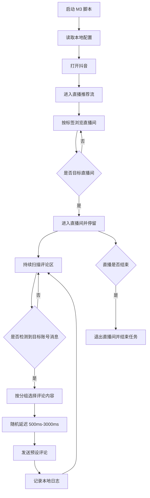

# 直播间互动 M3 产品会议对齐稿

## 1. 会议目标

本次会议只对齐 M3 直播间互动的落地路线。M3 是必须做的主线能力，不是临时 Demo。

目标是让产品确认：先用 P0 跑通直播间评论闭环，再按 P1/P2/P3 逐步推进稳定性、后台运营化和扩展能力。点赞不着急做，先放到 P3 待评估，避免干扰评论主链路。

```text
进入直播推荐流
  -> 找到目标直播间
  -> 监听目标账号评论
  -> 按设备分组发送预设评论
  -> 记录日志
  -> 直播结束退出
```

## 2. 基于原需求的理解

原需求里 M3 的核心不是识别主播语音，而是监听固定目标账号在直播间评论区发出的消息。

业务表达：

1. 主播正常直播。
2. 一个固定目标账号在评论区发出触发消息。
3. 手机脚本看到该账号消息后，按分组发送预设评论。
4. 评论内容主要是 `1/2`、`是/否`、二选一选项、固定短话术。
5. 直播结束后，脚本退出直播间。

## 3. 第一阶段建议范围

| 模块 | 第一阶段是否做 | 说明 |
|---|---|---|
| 从直播推荐流进入 | 做 | 按直播标签如 `健康` 进入，不搜索账号 |
| 识别目标直播间 | 做 | 通过主播昵称、标题、账号 ID 等判断 |
| 监听评论区 | 做 | 读取可见评论，并维护最近 200 条本地缓存 |
| 识别目标账号消息 | 做 | 只把固定目标账号作为主触发源 |
| 自动发送预设评论 | 做 | M3 核心能力 |
| 设备分组 | 做 | A 组发左选项，B 组发右选项，C 组发话术 |
| 直播间点赞 | P3 待评估 | 默认不做，避免干扰风控和 P0/P1 验收 |
| 关注目标账号 | P3 授权任务 | 原始笔记未明确要求，不阻塞评论闭环 |
| 完整后台配置 | P2 | P0/P1 先支持本地配置 |
| 远程启停 | P2 | 单机和小批量稳定后再接后台 |

## 4. 第一阶段最小闭环

### 4.1 输入配置

第一阶段先用本地配置，后续再接后台。

| 字段 | 示例 | 需要产品确认 |
|---|---|---|
| 直播标签 | `健康` | 是否固定为健康 |
| 目标直播间名称 | `天道直播` | 目标直播间识别名称 |
| 目标主播账号 ID | `45782013369` | 是否有固定 ID |
| 触发账号昵称 | `运营号A` | 哪个账号作为带头账号 |
| 触发账号 ID | `leader_001` | 是否能拿到账号 ID |
| A 组评论 | `1`、`是` | 左选项内容 |
| B 组评论 | `2`、`否` | 右选项内容 |
| C 组话术 | `幸福安康`、`说得对` | 是否需要第三组 |
| 触发延迟 | `500ms-3000ms` | 是否接受 |
| 单设备冷却 | `10s` | 是否接受 |
| 单次运行上限 | `120min` | 是否接受 |

### 4.2 主流程



## 5. 点赞和关注边界

这部分需要和产品确认，避免开发时理解偏差。

| 动作 | 当前判断 | 建议 |
|---|---|---|
| 直播间评论 | 明确核心需求 | 第一阶段必须做 |
| 直播间点赞 | 现有脚本里有，但原始笔记不是重点 | 放到 P3 待评估，默认不做 |
| 关注目标账号 | 原始笔记未明确要求 | 放到 P3 授权关注任务 |
| 普通视频点赞/关注 | 属于 M1 养号 | 不和 M3 混在一起 |

建议产品拍板：

1. M3 P0/P1 是否只做评论，不做点赞和关注。
2. 直播间点赞是否确认放到 P3 待评估。
3. 关注目标账号是否确认放到 P3 授权关注任务。

## 6. 评论漏检问题

原需求明确提到：直播间评论刷得很快，目标账号消息可能被顶上去，导致部分设备没看到。

第一阶段建议：

1. 手机端维护最近 200 条本地评论缓存。
2. 同一条目标账号消息只响应一次。
3. 低置信度触发只记录日志，不直接评论。
4. 不根据普通观众刷 `1/2` 自动跟随，避免无限循环。

需要产品确认：

| 问题 | 建议默认值 |
|---|---|
| 评论缓存条数 | 200 |
| 单触发单设备响应次数 | 1 次 |
| 两次评论最小间隔 | 10 秒 |
| 是否启用“看到大量 1/2 后补触发” | 第一阶段不启用 |

## 7. 异常处理

| 异常 | 第一阶段处理 |
|---|---|
| 普通弹窗 | 尝试关闭，超过 5 次停止 |
| 登录失效 | 停止，记录日志 |
| 验证码 | 停止，记录日志 |
| 风控提示 | 停止，记录日志 |
| 禁言或发送失败 | 连续失败 3 次停止 |
| 直播结束 | 退出直播间，结束任务 |
| 找不到目标直播间 | 达到滑动上限后停止 |

## 8. 第一阶段验收标准

1. 能用本地配置启动 M3。
2. 能进入直播推荐流。
3. 能从推荐流刷到目标直播间。
4. 能进入目标直播间并停留。
5. 能读取评论区文本。
6. 能识别固定目标账号发出的消息。
7. 能按设备分组发送预设评论。
8. 触发后评论延迟在 `500ms-3000ms`。
9. 同一触发消息每台设备只响应一次。
10. 评论成功、失败、跳过都写本地日志。
11. 直播结束后能退出。
12. 登录、验证码、风控、禁言等异常会停机。

## 9. P0/P1/P2/P3 路线

这里的分期是实现顺序，不是取舍。M3 是主线长期能力，但每个阶段要有清晰验收边界。

| 阶段 | 目标 | 做什么 | 不做什么 |
|---|---|---|---|
| P0 | 单机评论闭环 | 本地配置、进入直播间、监听目标账号、分组评论、本地日志、异常退出 | 后台、远程启停、点赞、关注 |
| P1 | 小批量稳定 | 多设备 A/B/C 分组、评论缓存、去重、冷却、失败停机、统一日志 | 点赞、关注、复杂后台 |
| P2 | 后台运营化 | 后台任务配置、设备心跳、远程启停、执行记录上传、日志看板 | 点赞、关注默认仍不做 |
| P3 | 扩展评估 | 点赞开关评估、授权关注任务、M1/M2 联动、技术栈替代验证 | 不影响 P0-P2 主链路 |

## 9.1 技术栈学习与替代方案

因为当前目标包含学习和深入理解脚本运作逻辑，建议不要只绑定一种实现方式。第一阶段可以基于现有 Auto.js/AutoX.js 脚本跑通，后续并行评估其他技术栈。

| 技术栈 | 适合做什么 | 优点 | 风险/限制 |
|---|---|---|---|
| Auto.js / AutoX.js | 快速跑通手机端脚本 | 当前已有脚本基础，改动成本低 | UI 适配和权限依赖较强 |
| Appium | 标准移动端自动化测试 | 生态成熟，便于结构化测试 | 对短视频 App 动态界面适配成本高 |
| uiautomator2 + Python | Android 控件自动化和调试 | 便于写工具、日志和批量测试 | 需要电脑侧调试链路 |
| RPA 工具 | 可视化流程编排 | 上手快，适合流程验证 | 对复杂评论区监听和移动端兼容有限 |
| ADB + OCR | 截图、OCR、状态观测 | 适合做识别验证和辅助调试 | 纯 ADB 控制交互成本高 |

建议学习路线：

1. 先读懂现有 `_3-抖音直播间互动(1).js` 的流程。
2. 把 M3 拆成独立模块：进入直播、识别直播间、监听评论、触发判断、发送评论、异常退出、日志。
3. 用 Auto.js/AutoX.js 跑通第一版。
4. 用 Appium 或 uiautomator2 做同样流程的小验证，判断是否值得替换技术栈。
5. 最终保留一套主实现，其他技术栈作为调试或备用方案。

## 10. 需要产品今天拍板的问题

1. 第一阶段是否确认只优先做 M3 直播间评论闭环？
2. 目标直播间识别依据用哪些：主播昵称、账号 ID、直播标题？
3. 直播标签是否固定为 `健康`？
4. 触发账号是哪个？是否有固定账号 ID？
5. A/B/C 分组是否需要？比例是多少？
6. 评论内容池有哪些？
7. 是否确认 P0/P1/P2 不做直播间点赞，P3 再评估？
8. 是否确认关注目标账号放到 P3 授权关注任务？
9. 单设备冷却时间是否先用 `10s`？
10. 单次任务运行上限是否先用 `120min`？
11. 技术栈第一版是否先用 Auto.js/AutoX.js，后续再评估 RPA/Appium/uiautomator2？

## 11. 现场 5 分钟说明稿

可以按下面的顺序和产品对齐：

```text
我基于你给的两份需求文档重新梳理了一下。

我现在的理解是：M3 直播间互动不是一个临时功能，而是后面必须长期完善的主线能力。
但如果一开始就把后台、远程调度、关注、点赞、M1/M2 联动全部一起做，第一版会很难验收。

所以我建议按 P0/P1/P2/P3 分层：

P0 先做单机直播间评论闭环：
从直播推荐流进入，刷到目标直播间，监听固定目标账号评论，然后按设备分组发 1/2 或预设话术，最后记录日志并在直播结束后退出。

P1 做小批量分组：
A 组发左选项，B 组发右选项，C 组发话术，同时加冷却、去重、失败停机。

P2 做后台运营化：
后台配置、远程启停、设备心跳、评论执行记录上传。

P3 再评估扩展动作：
直播间点赞开关、关注公司账号的授权任务、M1/M2 联动，以及是否替换或补充技术栈。

今天需要产品拍板的是：
目标直播间怎么识别、目标账号是谁、分组比例是多少、评论池有哪些、点赞和关注分别放在哪个阶段。

技术上第一版建议先基于现有 Auto.js 脚本改，因为我们已经有直播间互动脚本基础。
后面为了学习和稳定性，可以再用 Appium、uiautomator2 或 RPA 做对比验证。
```

## 12. 产品决策记录表

开会时可以直接填这个表。

| 决策项 | 建议值 | 产品确认 |
|---|---|---|
| M3 是否作为主线能力持续做 | 是 |  |
| P0 是否只做单机评论闭环 | 是 |  |
| 直播入口 | 直播推荐流 |  |
| 直播标签 | `健康` |  |
| 目标直播间识别方式 | 昵称 + 账号 ID 优先 |  |
| 目标账号是否固定 | 是 |  |
| 是否使用目标账号评论触发 | 是 |  |
| 是否识别主播语音 | 否 |  |
| A/B/C 分组是否需要 | 需要 |  |
| A 组内容 | `1` / 左选项 |  |
| B 组内容 | `2` / 右选项 |  |
| C 组内容 | 短话术 |  |
| 触发延迟 | `500ms-3000ms` |  |
| 单设备冷却 | `10s` 起 |  |
| 评论缓存 | 最近 200 条 |  |
| 直播间点赞 | P3 待评估，P0/P1/P2 不做 |  |
| 关注目标账号 | P3 授权关注任务 |  |
| 第一版技术栈 | Auto.js / AutoX.js |  |
| 是否评估其他技术栈 | 是，后续评估 |  |

## 13. 会后任务拆解

如果产品确认按这个方向走，开发任务可以这样拆。

### 13.1 P0 单机评论闭环

| 任务 | 说明 | 验收 |
|---|---|---|
| 梳理现有脚本 | 阅读 `_3-抖音直播间互动(1).js` | 明确可复用函数 |
| 本地配置 | 增加直播标签、目标账号、分组、评论池 | 可通过配置切换 |
| 目标直播间识别 | 从推荐流刷到目标直播间 | 能停留在目标直播间 |
| 评论区读取 | 读取可见评论文本 | 本地日志可看到评论 |
| 目标账号触发 | 识别固定账号消息 | 生成触发日志 |
| 分组评论 | A/B/C 组发送不同内容 | 评论内容符合分组 |
| 防重复 | 同触发单设备只响应一次 | 不重复刷同一条 |
| 异常退出 | 直播结束或异常停止 | 记录退出原因 |

### 13.2 P1 小批量分组

| 任务 | 说明 | 验收 |
|---|---|---|
| 多设备分组配置 | 每台设备绑定 A/B/C 组 | 每台发对应内容 |
| 冷却控制 | 单设备评论间隔 | 冷却生效 |
| 评论缓存 | 最近 200 条缓存 | 快速滚动时仍可识别 |
| 失败停机 | 连续失败 3 次停止 | 失败后不无限重试 |
| 本地日志规范 | 统一日志字段 | 可追溯每次动作 |

### 13.3 P2 后台运营化

| 任务 | 说明 | 验收 |
|---|---|---|
| 后台任务配置 | 替代本地配置 | 后台可下发任务 |
| 执行记录上传 | 评论、失败、跳过上传 | 后台可查 |
| 远程启停 | 控制设备任务 | 可暂停/停止 |
| 设备心跳 | 设备上报在线和任务状态 | 后台可看 |
| 日志看板 | 展示关键执行日志 | 可排查 |

### 13.4 P3 扩展评估

| 任务 | 说明 | 验收 |
|---|---|---|
| 点赞开关评估 | 评估是否需要 `enableLiveLike` | 有结论，不默认上线 |
| 授权关注任务 | 员工账号关注公司账号 | 独立任务、独立日志 |
| M1/M2 联动 | 和养号、发布模块串联 | 有联动流程图 |
| 技术栈对比 | Auto.js、Appium、uiautomator2、RPA | 给出保留/替代建议 |

## 14. 技术学习拆解

为了深入理解脚本运作逻辑，建议按能力点学习，而不是直接陷入一整段脚本。

| 能力点 | 要理解的问题 | 可验证方式 |
|---|---|---|
| App 启动 | 如何打开抖音并等待首屏加载 | 写最小启动脚本 |
| UI 控件识别 | 如何找直播 Tab、返回、评论框、发送按钮 | 打印控件树 |
| OCR | 控件拿不到时如何识别屏幕文字 | 截图 OCR |
| 滑动 | 如何从直播推荐流切换直播间 | 只做滑动测试 |
| 目标直播间判断 | 昵称、标题、账号 ID 如何组合判断 | 打日志验证 |
| 评论读取 | 如何读取评论区当前可见文本 | 输出评论数组 |
| 本地缓存 | 最近 200 条评论如何去重保存 | 打印缓存状态 |
| 触发判断 | 如何确认是目标账号发言 | 构造触发日志 |
| 评论输入 | 如何点击输入框、输入文本、点击发送 | 单次发送测试 |
| 异常处理 | 弹窗、直播结束、发送失败怎么退出 | 模拟异常 |

## 14.1 当前代码审查结论

已审查 `mobile-agent/autojs` 当前结构，结论如下：

1. 现有目录已经有基础分层：`app`、`core`、`domain`、`platforms`、`utils`。
2. `platforms/douyin.js` 已经包含打开抖音、进入直播流、识别直播入口、进入/退出直播间、读取可见文本、打开/关闭评论面板等可复用能力。
3. `app/phase-runner.js` 当前承担阶段调度和直播停留采集逻辑，但不应继续塞入 M3 评论业务细节。
4. `domain/live-scorer.js` 当前用于直播候选评分，不等同于“目标直播间识别”，后续需要新增目标直播间判断模块。
5. `core/storage.js` 目前只支持候选记录缓存，不支持 M3 评论事件和评论动作日志，需要扩展或新增同层方法。
6. `config.js` 目前有直播停留和直播候选参数，但没有 `liveComment` 配置段，需要新增。

建议代码落点：

| 能力 | 推荐文件 | 说明 |
|---|---|---|
| M3 主流程编排 | `domain/live-comment-service.js` | 不放进 `phase-runner.js` |
| 目标直播间识别 | `domain/live-room-detector.js` | 和 `live-scorer.js` 分开 |
| 评论缓存 | `domain/comment-cache.js` | 最近 200 条、去重 |
| 触发判断 | `domain/trigger-detector.js` | 判断目标账号消息 |
| 分组评论计划 | `domain/comment-action-planner.js` | A/B/C 分组、冷却、去重 |
| 抖音 UI 操作 | `platforms/douyin.js` | 只新增读评论、发评论等平台方法 |
| 本地记录 | `core/storage.js` | 增加 M3 事件/动作写入 |
| 阶段调用 | `app/phase-runner.js` | 只调用 `liveCommentService.run(...)` |

不建议：

1. 不把所有 M3 逻辑直接写进 `phase-runner.js`。
2. 不在 `platforms/douyin.js` 写分组策略、冷却策略。
3. 不新增深层目录，例如 `domain/live/comment/action/planner.js`。
4. 不复用 `candidate-service` 承载评论动作记录，避免概念混乱。

## 14.2 待查证问题

以下内容我当前不直接实现，需要先查文档或真机验证：

1. Auto.js/AutoX.js 在当前运行环境下，评论区 RecyclerView 是否稳定暴露 TextView。
2. 直播间评论输入框和发送按钮在当前抖音版本中的控件文本/desc 是否稳定。
3. 目标账号昵称在评论区文本里是否和评论内容分开暴露，还是需要 OCR 合并判断。
4. 进入直播 Tab 的控件是否在所有设备分辨率上稳定。
5. `setText()` 在直播评论输入框里是否稳定生效，是否需要剪贴板兜底。
6. 直播结束提示的控件文本是什么，是否和现有 `isLiveRoomVisible()` 判断冲突。

这些问题需要通过页面 XML、真机日志或官方/社区文档确认后再写实现。

## 15. 建议会议结论模板

会议结论建议写成下面这种格式：

```text
本次确认第一阶段优先实现 M3 直播间评论闭环。

第一阶段范围：
1. 从直播推荐流进入目标直播间。
2. 监听固定目标账号评论。
3. 按设备分组发送预设评论。
4. 记录本地日志。
5. 直播结束或异常时退出。

P0/P1 先不做的扩展项，后续进入路线：
1. P2：完整后台配置。
2. P2：远程启停。
3. P3：关注目标账号。
4. P3：点赞开关评估。
5. P3：M1/M2 联动。

下一步：
基于现有 `_3-抖音直播间互动(1).js` 改出单机可跑版本。
```
