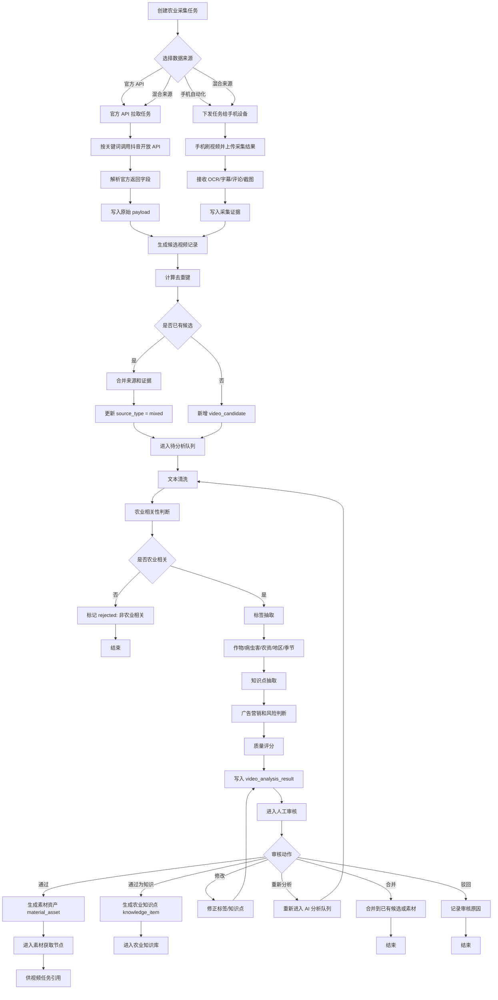
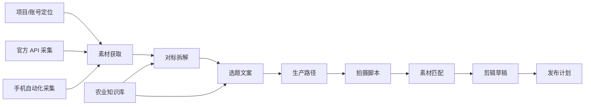

# 后台官方 API 与手机采集处理流程图

## 1. 流程说明

该流程描述后台如何同时接入官方开放 API 和手机自动化脚本上报数据，并统一进入候选视频、去重、AI 分析、人工审核、素材库和农业知识库。

外部采集结果进入素材获取环节，为后续对标拆解、选题文案、生产路径、拍摄脚本、素材匹配、剪辑草稿、发布计划提供素材输入。

## 2. Mermaid 流程图

## 3. 关键数据流

| 来源 | 入库对象 | 后续处理 |
|---|---|---|
| 官方 API | `video_candidate.raw_payload` | 去重、AI 分析、审核 |
| 手机 OCR | `video_capture_evidence.content_text` | 文本清洗、知识抽取 |
| 手机截图 | `video_capture_evidence.file_url` | 审核证据 |
| 手机评论 | `video_candidate.hot_comments_json` | 热点观点和用户问题分析 |
| AI 结果 | `video_analysis_result` | 审核、入素材库、入知识库 |
| 审核结果 | `review_record` | 审计和版本追溯 |

## 4. 与视频生产流程的关系

说明：

1. 定位来自项目/账号层，不在单条视频采集时重新生成。
2. 外部采集只进入素材获取，不替代对标拆解、选题文案和后续生产流程。
3. AI 生成的标签、知识点和评分必须支持人工修改、通过、驳回和重新分析。

## 5. 验证点

1. 官方 API 和手机端数据都能写入统一候选视频模型。
2. 同一视频多来源采集后能合并为一条候选，保留多来源证据。
3. AI 分析结果与原始证据可追溯。
4. 审核通过后才能进入素材库或农业知识库。
5. 外部采集不会直接生成发布计划，不绕过原有视频任务生命周期。
