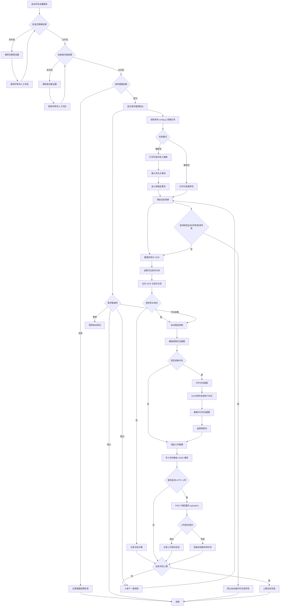

# 手机自动化脚本流程图

## 1. 流程说明

该流程描述手机端自动化脚本从启动、读取本地任务配置、打开抖音、刷视频、识别农业内容、采集评论和截图、写入本地缓存、可选上传 HTTP 接收端到结束任务的完整链路。

手机端是采集执行器，不负责最终知识判断。当前项目只实现手机脚本自动化，不实现后台管理、数据库、官方 API、AI 分析、审核和入库。

## 2. Mermaid 流程图

## 3. 关键状态

| 状态 | 说明 |
|---|---|
| `INIT` | 启动脚本，加载配置 |
| `PERMISSION_CHECK` | 检查无障碍、悬浮窗、截图权限 |
| `TASK_READY` | 已读取本地任务配置 |
| `OPEN_PLATFORM` | 打开抖音 |
| `ENTER_FLOW` | 进入搜索流或推荐流 |
| `WATCHING` | 当前视频停留和观察 |
| `OCR_READING` | 截图和 OCR |
| `EVALUATING` | 判断农业相关性 |
| `CAPTURING` | 采集视频页、评论页、截图证据 |
| `SAVING` | 写入本地缓存 |
| `UPLOADING` | 可选 HTTP 上传 |
| `RECOVERING` | 异常恢复 |
| `STOPPED` | 任务停止 |

## 4. 验证点

1. 每个任务必须产生开始、结束和异常日志。
2. 每次命中农业内容必须保留证据截图或 OCR 原文。
3. 任务停止后不再执行点击、滑动、评论区打开等操作。
4. 风控、验证码、登录异常出现时必须停止自动化。
5. 命中候选必须先写入本地缓存，不能依赖上传成功。
6. 上传失败必须保留本地缓存，不能静默丢弃。
