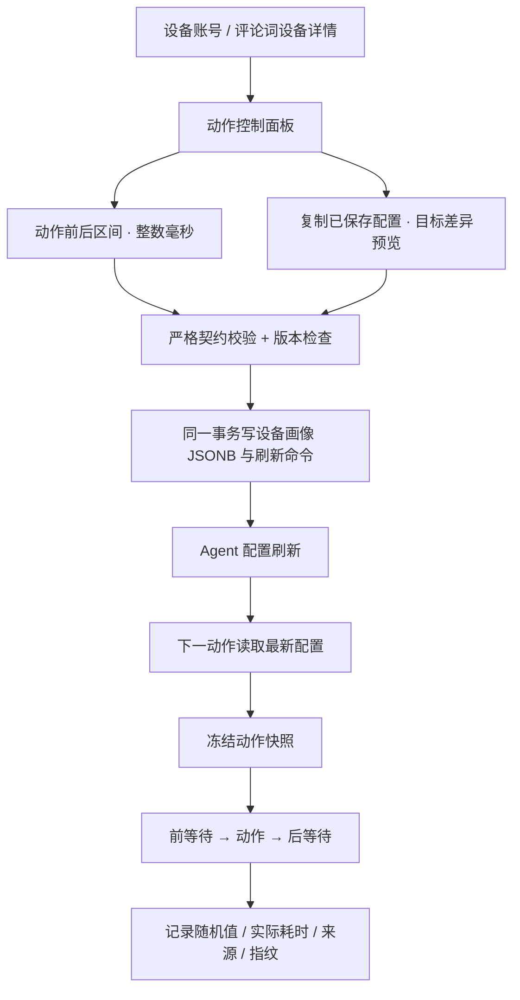

# 评论词按设备动作间隔实施与验收

日期：2026-09-14。用户已确认开始代码实现。

设计依据：`docs/方案设计/功能方案/远程脚本功能模块方案.md` 中“2026-09-14 评论词按设备动作间隔”补充；本文件记录实施拆分与验收，不另设冲突契约。

## 交付范围

每台设备独立配置评论词动作前、动作后的随机整数毫秒区间；保存后复制到所选设备。第一版提供“动作间隔”，预留但禁用“动作路径”“动作范围”。本轮完成源码和离线验证，不构建/安装 APK、不发布业务包、不操作手机或执行用户任务。

## 统一计时接口

字段：`deviceProfile.commentActionTiming = {schemaVersion:1, enabled, actions:{key:{beforeMs:[min,max],afterMs:[min,max]}}}`。

每个边界允许 0–120000ms，支持固定区间；缺省边界继承默认值。相邻动作总等待为前一步 after + 后一步 before，不包括系统响应、识别或手势本身的耗时。停用自定义后保留编辑值并使用设备默认行为；首版复制要求先启用、保存完整配置。

| 动作键 | 默认动作前（ms） | 默认动作后（ms） |
|---|---:|---:|
| openDouyin | 0 | 5000–7000，兼容已有设备 openDouyinWaitMs |
| openSearchEntry | 0 | 600–1000 |
| setSearchKeyword | 0 | 500–800 |
| submitSearch | 0 | 300–900 |
| openLiveTab | 0 | 3500–7000，原两层等待合并 |
| openFirstLive | 0 | 7500–8500 |
| readViewerCount | 0 | 0 |
| detectCommerceCart | 0 | 0 |
| openAnchorSummary | 5000–7000 | 0 |
| openAnchorProfile | 5000–7000 | 0 |
| readRoomIdentity | 5000–7000 | 0 |
| closeAnchorProfile | 5000–7000 | 0 |
| readComments | 0 | 0 |
| swipeComments | 0 | 2500–4500 |
| finishRoomCapture | 0 | 800–1200，仅本房抓取完成分支 |
| nextLive | 0 | 7500–8500 |
| commentOcrRetry | 350–650 | 0 |

## 实施拆分

- [x] Task 1：`action-timing.js` 统一默认值、严格范围回退、动态配置、单动作快照、停止切片、日志；共享 types 与手机默认值交叉校验。
- [x] Task 2：`navigation.js` 评论词专用无附带业务延迟导航；`timed-runtime-actions.js` 包装动作；workflow/runner 去除生产路径重复等待。保留有限节点探测、手势内部停留和验证保护。运行中清除配置恢复默认；到期不再派新动作，已完成结果保留。
- [x] Task 3：独立 timing GET/PATCH、批量复制、父画像 CAS；不新增 DB 字段。配置与 REFRESH_CONFIG 在同一事务，复制保留目标其他画像字段，源/目标冲突则整批回滚。
- [x] Task 4：独立动作面板、动画、毫秒输入、相邻等待说明、复制差异预览；父子编辑器校验版本连续性，不能把子页面新版本与父页面旧数据拼接覆盖。
- [x] 补充 Task 3a：评论任务运行中的专用配置控制消息以 FETCHED 领取；兼容旧 APK 自动 RUNNING 回报但保留 FETCHED 状态；DONE/FAILED 沿用原回执。保留单业务任务索引、STOP 优先、租户/设备范围、60 秒控制消息租约。
- [x] Task 5：最终 Bun 定向 39/39、手机核心 56/56、manifest 7/7、隔离数据库事务 1/1；类型检查、前后端构建、核心 ESLint 通过。手机全套 171/188，17 既有失败及旧 bundle 固定版本的 4 个失败已如实记录。完成独立审查、源码行数检查、项目记录和截图归档。

## 用户手动验收顺序（交付部署后）

1. 打开“设备账号”，选择设备画像中的“评论词动作间隔”；评论词设备详情也有入口。
2. 在“打开抖音”的动作后填入例如 `10001`、`14000`。选择某一动作前填相同两数，验证固定等待显示；清空或反转区间时不允许保存。
3. 保存后进入“复制配置”，勾选目标，检查变化预览并确认。修改源设备后，目标应保持自己的副本。
4. 用户手动启动评论任务，核对日志 `comment action timing wait` 的 actionKey、side、sampledMs、actualMs、source、profileHash；采样值应在所填范围内。不要用整个动作耗时替代纯等待耗时。
5. 任务运行中保存另一区间，待手机收到配置后检查下一动作使用新值；当前动作前后使用原快照。再停用自定义，检查恢复默认。
6. 分别验证等待期间停止、分钟数到期、已抓取评论保留；确认视频养号和直播互动的行为没有被评论词专用导航改变。

首次交付需更新 API/Web，并通过更新中心交付包含新增 helper 的完整兼容业务包。已安装基座兼容时无需为本次业务文件重新打 APK；之后只调整间隔参数，直接前端保存即可。手机实际加载来源和人工动作验收仍需独立确认。
