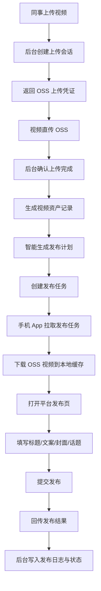

# 智能发布视频后台方案

## 1. 文档目标

本方案定义后台新增的“智能发布视频”板块，用于承接同事上传视频、存入 OSS、生成发布任务、下发给手机 App 自动发布、回传发布结果的完整流程。

这个功能属于视频生产后的发布支路，不改变现有的视频采集、评论、设备监控主链路。

## 2. 设计原则

1. 视频文件先入 OSS，再进入发布任务。
2. 业务元数据留在数据库，OSS 只存文件对象。
3. AccessKey 只放环境变量或密钥管理，不写入前端和仓库。
4. 上传、审核、发布、回传都要可追踪、可重试、可审计。
5. App 只负责执行发布，不负责生成发布策略。
6. 智能发布先做“规则驱动 + 人工可控”，后续再扩展更复杂的自动推荐。

## 3. 总体流程

```text
同事上传视频
  -> 后台创建视频资产记录
  -> 返回 OSS 上传凭证
  -> 同事直传 OSS
  -> 上传完成回调/确认
  -> 后台生成视频资产
  -> 智能生成发布任务
  -> 下发给手机 App
  -> App 下载 OSS 视频
  -> 打开平台发布页
  -> 填写标题、文案、封面、话题
  -> 提交发布
  -> 回传结果和截图证据
```

### 3.1 处理关系



## 4. 新增后台板块

后台至少增加 5 个板块：

| 板块 | 作用 |
|---|---|
| 视频素材库 | 管理上传完成的视频、封面、时长、大小、审核状态和 OSS 对象信息 |
| 发布任务队列 | 管理待发布、执行中、成功、失败、暂停的任务 |
| 发布计划 | 展示智能生成的发布时间、账号、标题、话题和设备分配 |
| 发布结果 | 查看 App 执行结果、平台返回、截图和错误原因 |
| 账号与设备配置 | 维护平台账号、发布窗口、设备绑定和每日限制 |

## 5. OSS 与配置

### 5.1 环境变量

建议统一使用环境变量：

```text
OSS_REGION=oss-cn-wuhan-lr
OSS_BUCKET=dfc-video-upload
OSS_ENDPOINT=https://oss-cn-wuhan-lr.aliyuncs.com
OSS_ACCESS_KEY_ID=...
OSS_ACCESS_KEY_SECRET=...
```

说明：

1. `OSS_ENDPOINT` 可由 `OSS_REGION` 推导，默认使用外网 Endpoint。
2. 若后台与 OSS 同地域部署，可单独切换内网 Endpoint。
3. 访问密钥只能留在服务端，不下发到前端或手机端。

### 5.2 上传方式

推荐两种方式，优先第 1 种：

1. 后台签发 OSS 直传凭证，前端直传 OSS。
2. 后台接收文件后再转存 OSS。

第 1 种更适合视频大文件，能减少后台带宽和超时风险。

### 5.3 对象命名

建议对象 key 统一按业务分层：

```text
publish-video/{tenantId}/{yyyy}/{mm}/{dd}/{uuid}_{originalName}
```

如果有封面图，再用同一前缀保存：

```text
publish-video/{tenantId}/{yyyy}/{mm}/{dd}/{uuid}_cover.jpg
```

## 6. 数据模型

### 6.1 `publish_video_asset`

视频素材主表，记录 OSS 对象和业务元数据。

| 字段 | 类型 | 说明 |
|---|---|---|
| `id` | uuid | 主键 |
| `tenant_id` | varchar(64) | 租户 |
| `title` | varchar(200) | 素材标题 |
| `original_name` | varchar(255) | 原始文件名 |
| `oss_region` | varchar(64) | OSS 地域 |
| `oss_bucket` | varchar(128) | Bucket |
| `object_key` | varchar(512) | 视频对象 key |
| `cover_object_key` | varchar(512) | 封面对象 key |
| `file_size` | bigint | 文件大小 |
| `duration_seconds` | int | 视频时长 |
| `md5` | varchar(64) | 去重指纹 |
| `width` | int | 视频宽度 |
| `height` | int | 视频高度 |
| `review_status` | varchar(32) | `pending` / `approved` / `rejected` |
| `asset_status` | varchar(32) | `uploading` / `uploaded` / `ready` / `archived` |
| `created_at` | timestamptz | 创建时间 |
| `updated_at` | timestamptz | 更新时间 |

### 6.2 `publish_upload_session`

上传会话表，用于记录前端拿到的上传凭证和完成状态。

| 字段 | 类型 | 说明 |
|---|---|---|
| `id` | uuid | 主键 |
| `asset_id` | uuid | 关联素材 |
| `upload_token` | varchar(128) | 上传会话 token |
| `expire_at` | timestamptz | 过期时间 |
| `status` | varchar(32) | `issued` / `uploaded` / `expired` |
| `created_at` | timestamptz | 创建时间 |

### 6.3 `publish_task`

发布任务表，控制 App 自动发布流程。

| 字段 | 类型 | 说明 |
|---|---|---|
| `id` | uuid | 主键 |
| `tenant_id` | varchar(64) | 租户 |
| `asset_id` | uuid | 视频素材 |
| `account_id` | uuid | 发布账号 |
| `device_id` | uuid | 执行设备 |
| `platform` | varchar(32) | 平台，如 `douyin` |
| `publish_mode` | varchar(32) | `manual` / `auto` / `schedule` |
| `publish_at` | timestamptz | 计划发布时间 |
| `title_text` | text | 发布标题 |
| `caption_text` | text | 发布文案 |
| `topic_tags` | jsonb | 话题标签 |
| `status` | varchar(32) | `draft` / `ready` / `assigned` / `publishing` / `success` / `failed` / `paused` |
| `retry_count` | int | 重试次数 |
| `last_error` | text | 最近错误 |
| `created_at` | timestamptz | 创建时间 |
| `updated_at` | timestamptz | 更新时间 |

### 6.4 `publish_task_run`

发布执行日志表，记录每次下发和 App 回传。

| 字段 | 类型 | 说明 |
|---|---|---|
| `id` | uuid | 主键 |
| `task_id` | uuid | 发布任务 |
| `device_id` | uuid | 执行设备 |
| `start_at` | timestamptz | 开始时间 |
| `finish_at` | timestamptz | 结束时间 |
| `step_name` | varchar(64) | 当前步骤 |
| `result_code` | varchar(32) | 成功/失败码 |
| `result_message` | text | 结果说明 |
| `screenshot_key` | varchar(512) | 截图对象 key |
| `raw_payload` | jsonb | 原始回传 |

### 6.5 `publish_account_binding`

发布账号与设备绑定表。

| 字段 | 类型 | 说明 |
|---|---|---|
| `id` | uuid | 主键 |
| `platform` | varchar(32) | 平台 |
| `account_name` | varchar(128) | 账号名 |
| `device_id` | uuid | 绑定设备 |
| `daily_limit` | int | 日发布上限 |
| `publish_window` | jsonb | 发布时段 |
| `status` | varchar(32) | `enabled` / `disabled` |

## 7. 接口设计

### 7.1 上传初始化

```http
POST /api/v1/admin/publish-assets/upload-init
```

作用：

1. 创建视频素材记录。
2. 返回 OSS 直传凭证或临时上传地址。
3. 返回上传完成后确认所需的 token。

### 7.2 上传完成确认

```http
POST /api/v1/admin/publish-assets/:id/complete
```

作用：

1. 确认视频已经落到 OSS。
2. 读取视频大小、时长、分辨率、MD5。
3. 更新素材状态为 `uploaded` 或 `ready`。

### 7.3 素材列表与详情

```http
GET /api/v1/admin/publish-assets
GET /api/v1/admin/publish-assets/:id
```

### 7.4 发布任务创建

```http
POST /api/v1/admin/publish-tasks
POST /api/v1/admin/publish-tasks/:id/dispatch
POST /api/v1/admin/publish-tasks/:id/retry
```

### 7.5 App 拉取任务

```http
GET /api/v1/mobile/publish/tasks/current?deviceId=xxx
```

### 7.6 App 回传结果

```http
POST /api/v1/mobile/publish/tasks/:id/result
POST /api/v1/mobile/publish/heartbeats
POST /api/v1/mobile/publish/runtime-logs
```

### 7.7 下载视频

App 不直接暴露 OSS 密钥，推荐由后台返回临时下载地址：

```http
GET /api/v1/mobile/publish/assets/:id/download-url
```

返回短期有效的 OSS Signed URL，App 直接下载到本地缓存。

## 8. App 自动发布流程

1. App 定时拉取待发布任务。
2. 校验设备、账号和任务状态。
3. 拉取视频下载地址并下载到本地缓存。
4. 打开平台 App，进入发布页。
5. 选择本地视频，填写标题、文案、话题和封面。
6. 如平台要求人工确认，则暂停任务并回传状态。
7. 提交发布。
8. 读取页面结果或返回截图。
9. 回传成功/失败、发布链接、错误原因和截图。

## 9. 智能发布规则

“智能”先做规则驱动，不一开始就做复杂 AI 决策。

### 9.1 基础规则

1. 按账号发布窗口选择发布时间。
2. 按账号标签选择素材类型。
3. 按发布上限控制每日任务数。
4. 按素材状态控制是否进入发布队列。
5. 按平台风险状态决定是否暂停。

### 9.2 可选增强

后续可增加：

1. 自动生成标题建议。
2. 自动生成话题标签。
3. 自动选择封面。
4. 按历史发布结果调整发布时间。

## 10. 状态机

### 10.1 素材状态

| 状态 | 说明 |
|---|---|
| `uploading` | 上传中 |
| `uploaded` | 已上传 OSS |
| `ready` | 已完成校验，可进入发布 |
| `review_pending` | 等待人工审核 |
| `approved` | 审核通过 |
| `rejected` | 审核驳回 |
| `archived` | 归档 |

### 10.2 任务状态

| 状态 | 说明 |
|---|---|
| `draft` | 草稿 |
| `ready` | 可发布 |
| `assigned` | 已分配设备 |
| `downloading` | 下载中 |
| `publishing` | 发布中 |
| `success` | 发布成功 |
| `failed` | 发布失败 |
| `paused` | 暂停 |

## 11. 失败处理

1. 上传失败可重新签发上传凭证。
2. OSS 回调失败可重试确认。
3. App 下载失败可重新拉取 Signed URL。
4. 发布页卡死、验证码、风控页时，任务暂停并回传原因。
5. 任务执行成功后，后台必须保留截图和原始回传。
6. 失败任务可在人工确认后重新下发，不自动无限重试。

## 12. 实施顺序

1. 先落素材表、上传会话表和 OSS 上传初始化接口。
2. 再落素材完成确认、列表和详情接口。
3. 再落发布任务表、任务分发和回传接口。
4. 再接入手机 App 下载和自动发布流程。
5. 最后补后台页面、审核流程和统计视图。

## 13. 验收标准

1. 同事可以通过后台上传视频并落到 OSS。
2. 后台能看到素材状态、OSS 对象和上传结果。
3. App 能拉取发布任务并完成一次视频发布。
4. 后台能查询发布成功、失败和原因。
5. 上传密钥不出现在前端、日志和仓库中。
