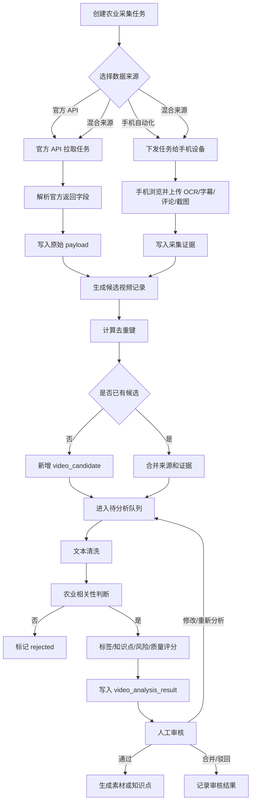
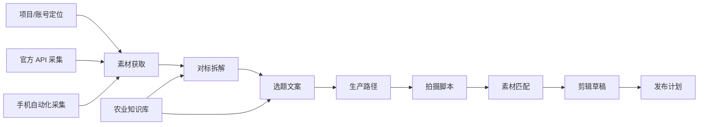

# 后台官方 API 与手机采集接入设计方案

## 1. 文档目标

本文定义农业知识采集项目的后台接入方案。后台同时接入抖音官方开放 API 和手机自动化脚本上报数据，将两类来源统一沉淀为候选视频，再进入素材获取、对标拆解、选题文案等后续流程。

外部采集是素材来源，不是主生产路径。视频任务仍然保留既有生产生命周期：定位、素材获取、对标拆解、选题文案、生产路径、拍摄脚本、素材匹配、剪辑草稿、发布计划。

## 2. 后台设计原则

1. 官方 API 和手机采集统一落到候选视频模型。
2. 原始数据必须保存，便于追溯和重新分析。
3. 结构化分析结果必须可审核、可修正、可驳回。
4. 去重逻辑优先保证不重复入库，其次保留多来源证据。
5. 后台不假设手机端识别完全准确，手机端只提供候选和证据。
6. 接入官方 API 时遵守平台授权、额度、用途限制。

## 3. 总体结构

```text
官方 API 采集任务
  -> API 拉取服务
  -> 候选视频入库

手机自动化脚本
  -> 上传采集结果
  -> 候选视频入库

候选视频
  -> 去重合并
  -> OCR/ASR/LLM 异步分析
  -> 人工审核
  -> 素材库/农业知识库
```

### 3.1 处理流程图



与视频生产流程的关系：



说明：

1. 定位来自项目/账号层，不在单条视频采集时重新生成。
2. 外部采集只进入素材获取，不替代对标拆解、选题文案和后续生产流程。
3. AI 生成的标签、知识点和评分必须支持人工修改、通过、驳回和重新分析。

## 4. 业务对象

| 对象 | 说明 | 使用方 |
|---|---|---|
| `collection_task` | 采集任务，定义平台、关键词、来源、频率 | 管理后台、调度服务、手机端 |
| `collector_device` | 手机采集设备 | 手机端、设备管理 |
| `official_api_job` | 官方 API 拉取任务 | 调度服务 |
| `video_candidate` | 候选视频统一表 | AI 分析、审核、素材库 |
| `video_capture_evidence` | 截图、OCR、评论等证据 | 审核、追溯 |
| `video_analysis_result` | AI 结构化分析结果 | 审核、知识库 |
| `review_record` | 人工审核记录 | 审核后台 |
| `material_asset` | 通过审核后的素材 | 视频生产流程 |
| `knowledge_item` | 抽取出的农业知识点 | 农业知识库 |

## 5. 数据库设计

### 5.1 `collection_task`

| 字段 | 类型 | 说明 |
|---|---|---|
| `id` | bigint | 主键 |
| `task_code` | varchar | 任务编码 |
| `name` | varchar | 任务名称 |
| `platform` | varchar | `douyin` 等 |
| `source_types` | json | `official_api`、`mobile_agent` |
| `keywords` | json | 关键词列表 |
| `mode` | varchar | `search`、`feed`、`topic` |
| `max_items` | int | 目标采集数量 |
| `status` | varchar | `draft`、`running`、`paused`、`finished` |
| `created_at` | datetime | 创建时间 |
| `updated_at` | datetime | 更新时间 |

### 5.2 `collector_device`

| 字段 | 类型 | 说明 |
|---|---|---|
| `id` | bigint | 主键 |
| `device_code` | varchar | 设备编码 |
| `device_name` | varchar | 设备名称 |
| `platform_support` | json | 支持平台 |
| `app_version` | varchar | 手机脚本或 APK 版本 |
| `status` | varchar | `online`、`offline`、`running`、`error` |
| `last_heartbeat_at` | datetime | 最近心跳 |

### 5.3 `video_candidate`

| 字段 | 类型 | 说明 |
|---|---|---|
| `id` | bigint | 主键 |
| `platform` | varchar | 平台 |
| `source_type` | varchar | `official_api` / `mobile_agent` / `mixed` |
| `source_video_id` | varchar | 官方视频 ID，可能为空 |
| `source_url` | varchar | 视频链接，可能为空 |
| `title` | text | 标题或主文案 |
| `description` | text | 描述 |
| `author_name` | varchar | 作者 |
| `cover_url` | varchar | 封面 |
| `metrics_json` | json | 点赞、评论、收藏、分享等 |
| `ocr_text` | text | 手机端 OCR 文本 |
| `subtitle_text` | text | 字幕文本 |
| `hot_comments_json` | json | 热门评论 |
| `raw_payload` | json | 原始 API 或手机端上报数据 |
| `dedupe_key` | varchar | 去重键 |
| `status` | varchar | 状态 |
| `created_at` | datetime | 创建时间 |
| `updated_at` | datetime | 更新时间 |

候选状态：

| 状态 | 说明 |
|---|---|
| `pending` | 待处理 |
| `deduplicated` | 已去重合并 |
| `analyzing` | 分析中 |
| `review_pending` | 待人工审核 |
| `approved` | 审核通过 |
| `rejected` | 审核驳回 |

### 5.4 `video_capture_evidence`

| 字段 | 类型 | 说明 |
|---|---|---|
| `id` | bigint | 主键 |
| `candidate_id` | bigint | 候选视频 ID |
| `task_id` | bigint | 采集任务 ID |
| `device_id` | bigint | 设备 ID |
| `evidence_type` | varchar | `screenshot`、`ocr`、`comment`、`metrics` |
| `content_text` | text | 文本内容 |
| `file_url` | varchar | 截图文件地址 |
| `captured_at` | datetime | 采集时间 |

### 5.5 `video_analysis_result`

| 字段 | 类型 | 说明 |
|---|---|---|
| `id` | bigint | 主键 |
| `candidate_id` | bigint | 候选视频 ID |
| `crop_tags` | json | 作物标签 |
| `topic_tags` | json | 技术主题 |
| `disease_tags` | json | 病虫害标签 |
| `region_tags` | json | 地区标签 |
| `season_tags` | json | 季节标签 |
| `knowledge_points` | json | 知识点列表 |
| `content_type` | varchar | 科普、经验、广告、新闻等 |
| `commercial_intent` | varchar | `low`、`medium`、`high` |
| `quality_score` | int | 内容质量分 |
| `risk_flags` | json | 风险标记 |
| `model_version` | varchar | 分析模型版本 |
| `created_at` | datetime | 创建时间 |

## 6. 接口设计

### 6.1 手机端上传候选视频

```http
POST /api/mobile/video-captures
```

请求体：

```json
{
  "taskId": "task_20260528_001",
  "deviceId": "android_001",
  "platform": "douyin",
  "sourceType": "mobile_agent",
  "keyword": "水稻病虫害",
  "screenText": "OCR 识别全文",
  "titleText": "水稻纹枯病怎么防",
  "subtitleText": "高温高湿一定要注意",
  "authorName": "农业老张",
  "metricsText": "点赞 1.2万 评论 368",
  "hotComments": ["这个办法有效", "东北能用吗"],
  "screenshotFileIds": ["file_001"],
  "capturedAt": "2026-05-28T10:00:00+08:00",
  "rawText": "OCR 原始全文"
}
```

响应：

```json
{
  "candidateId": 10001,
  "status": "pending",
  "duplicate": false
}
```

### 6.2 手机端领取任务

```http
GET /api/mobile/tasks/next?deviceId=android_001&platform=douyin
```

响应：

```json
{
  "taskId": "task_20260528_001",
  "platform": "douyin",
  "mode": "search",
  "keywords": ["水稻病虫害", "玉米高产"],
  "maxVideos": 100,
  "maxCaptures": 30,
  "staySecondsMin": 5,
  "staySecondsMax": 15,
  "collectComments": true,
  "commentLimit": 20
}
```

### 6.3 手机端心跳

```http
POST /api/mobile/devices/heartbeat
```

请求体：

```json
{
  "deviceId": "android_001",
  "status": "running",
  "taskId": "task_20260528_001",
  "viewedCount": 42,
  "capturedCount": 8,
  "lastMessage": "命中关键词: 水稻"
}
```

### 6.4 官方 API 采集任务触发

```http
POST /api/official/douyin/search-jobs
```

请求体：

```json
{
  "taskId": "task_20260528_001",
  "keywords": ["水稻病虫害", "玉米高产"],
  "maxResults": 100
}
```

官方 API 结果入库时统一写入 `video_candidate`，`source_type` 为 `official_api`。

## 7. 去重设计

去重优先级：

1. 平台视频 ID 相同。
2. 视频 URL 相同。
3. `platform + author_name + title_hash` 相同。
4. `platform + ocr_text_simhash` 相似。
5. 人工审核合并。

合并规则：

1. 官方 API 的标题、作者、封面、指标作为基础字段。
2. 手机端的 OCR、字幕、评论、截图作为证据字段。
3. 多来源命中时 `source_type` 更新为 `mixed`。
4. 原始数据全部保留到 `raw_payload` 和 `video_capture_evidence`。

## 8. AI 异步处理

候选视频入库后进入异步队列。

处理步骤：

1. 文本清洗：合并标题、描述、OCR、字幕、评论。
2. 农业相关性判断：过滤明显无关内容。
3. 标签抽取：作物、技术、病虫害、农资、地区、季节。
4. 知识点抽取：提炼可复用农业知识。
5. 风险判断：广告营销、夸大疗效、低可信、伪科学。
6. 质量评分：用于审核优先级排序。
7. 写入 `video_analysis_result`。
8. 状态更新为 `review_pending`。

## 9. 审核与入库

审核人员处理 `review_pending` 候选。

审核动作：

| 动作 | 结果 |
|---|---|
| 通过 | 生成素材或知识点 |
| 驳回 | 记录原因，不进入素材库 |
| 修改 | 修正标签和知识点 |
| 合并 | 与已有候选或素材合并 |
| 重新分析 | 触发 AI 再处理 |

通过后写入：

1. `material_asset`：作为素材获取结果，用于后续视频任务。
2. `knowledge_item`：作为农业知识库条目。

## 10. 实施顺序

1. 建立 `video_candidate`、`video_capture_evidence`、`collection_task` 表。
2. 实现手机端上传接口。
3. 实现候选视频列表和基础审核。
4. 接入抖音官方搜索 API。
5. 实现去重合并。
6. 实现 AI 结构化分析。
7. 实现审核通过后进入素材库和知识库。
8. 扩展多平台和多设备任务调度。

## 11. 验收标准

1. 官方 API 和手机端上报都能生成候选视频。
2. 同一视频多来源采集时可以合并，不重复进入审核。
3. 候选视频保留原始数据和截图/OCR 证据。
4. AI 能输出作物、主题、知识点、质量分、风险标记。
5. 审核通过后能进入素材库或知识库。
6. 外部采集结果只进入素材获取环节，不破坏原视频生产生命周期。
