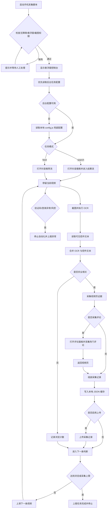

# 手机自动化脚本架构方案

## 1. 文档目标

本文定义农业知识采集项目的手机端自动化脚本方案。当前项目的手机端定位为农业内容浏览与采集执行器，负责在抖音等短视频平台中发现农业相关内容，提取候选视频信息，写入本地缓存，并上传到轻量后台用于运行监控、日志排查和农业兴趣内容观测。

外部采集结果进入素材获取环节，作为农业新媒体内容生产流程的素材来源，不替代原有视频任务生命周期。

当前项目实现轻量后台监控，不实现官方 API、AI 分析、审核入库、素材库和知识库等完整平台能力。这些内容只作为后续扩展方案。

## 2. 设计原则

1. 手机端只做采集执行，不做复杂知识分析。
2. 采集规则、关键词、任务时长、平台配置支持本地配置，接入后台后由后台任务接口下发。
3. 手机端上传原始证据，包括截图、OCR 文本、评论文本、页面指标文本。
4. 手机端不自动点赞、评论、关注、私信，不执行刷量或给其他账号自动互动的行为。
5. 手机端遇到验证码、登录异常、权限缺失、风控提示时停止任务并上报。
6. 第一阶段优先实现抖音单平台，后续按平台适配器扩展。

## 3. 当前技术栈

| 模块 | 技术选择 | 说明 |
|---|---|---|
| 运行环境 | AutoX.js / Auto.js | 优先脚本 App 内运行，暂不打包 APK |
| 脚本语言 | JavaScript | 使用 AutoX.js/Auto.js 兼容写法 |
| 手机能力 | 无障碍、悬浮窗、截图权限 | 用于控件读取、点击滑动、运行控制和 OCR 截图 |
| OCR | AutoX.js/Auto.js 可用 OCR 能力或插件 | 第一阶段封装为 `ocr.js`，便于替换 |
| 配置 | 本地 `config.js` + 后台任务接口 | 后台不可用时使用本地配置兜底 |
| 数据输出 | 本地 JSON 缓存 + 后台 HTTP POST | 上传失败时必须落本地缓存，后续补传 |
| 日志 | 本地文本日志 + 后台日志接口 | 记录任务开始、停止、命中、异常、上传结果 |

## 4. 第一阶段范围

第一阶段目标是跑通单手机、单平台、单任务的采集闭环。

| 模块 | 第一阶段能力 |
|---|---|
| 平台 | 抖音 |
| 入口 | 推荐流、搜索结果流 |
| 识别 | OCR 识别画面文案、字幕、按钮、评论 |
| 判断 | 农业关键词命中 |
| 采集 | 标题文本、字幕文本、作者文本、互动指标文本、热门评论、截图 |
| 输出 | 本地缓存候选视频，并上传到后台监控接口 |
| 控制 | 悬浮窗开始、暂停、跳过、手动采集、停止 |

## 5. 手机端功能模块

### 5.1 权限检查

脚本启动后必须检查：

| 权限 | 用途 | 缺失处理 |
|---|---|---|
| 无障碍服务 | 读取控件、点击、返回、滑动 | 跳转系统设置并暂停任务 |
| 悬浮窗 | 显示控制按钮和运行状态 | 跳转系统设置并暂停任务 |
| 截图权限 | OCR 识别视频画面和评论 | 请求授权，失败则停止任务 |
| 网络 | 拉取后台配置、上传采集结果、心跳和日志 | 失败后本地缓存并重试 |

### 5.2 任务配置

任务配置支持两种来源：优先从后台任务接口读取，后台不可用时使用本地 `config.js` 兜底。

| 字段 | 示例 | 说明 |
|---|---|---|
| taskId | `task_20260528_001` | 后台任务 ID 或本地任务 ID |
| platform | `douyin` | 平台标识 |
| mode | `search` / `feed` | 搜索流或推荐流 |
| keywords | `["水稻病虫害", "玉米高产"]` | 搜索词和匹配词 |
| maxVideos | `100` | 单次最多浏览视频数 |
| maxCaptures | `30` | 单次最多采集数量 |
| staySecondsMin | `5` | 每条视频最短停留 |
| staySecondsMax | `15` | 每条视频最长停留 |
| collectComments | `true` | 是否采集热门评论 |
| commentLimit | `20` | 单条视频最多评论数 |
| uploadEnabled | `true` | 是否启用后台上传 |
| uploadUrl | `http://127.0.0.1:3010/api/v1/mobile/collection-records` | 采集记录上传地址 |
| heartbeatUrl | `http://127.0.0.1:3010/api/v1/mobile/heartbeats` | 心跳上传地址 |
| logUrl | `http://127.0.0.1:3010/api/v1/mobile/runtime-logs` | 日志上传地址 |
| cacheDir | `/sdcard/AgriCollector/cache` | 上传失败或离线时的本地缓存目录 |

### 5.3 平台适配器

手机端按平台拆分适配器。第一阶段只实现抖音适配器。

| 适配器方法 | 说明 |
|---|---|
| `openApp()` | 打开平台 App |
| `openSearch(keyword)` | 进入搜索页并搜索关键词 |
| `enterVideoFeed()` | 进入视频流 |
| `extractScreen()` | 截图并 OCR 当前画面 |
| `isTargetContent(text)` | 判断是否农业相关 |
| `openComments()` | 打开评论面板 |
| `extractHotComments(limit)` | 获取热门评论文本 |
| `nextVideo()` | 滑动到下一条视频 |
| `recover()` | 卡住时返回、重进或重启平台 |

### 5.4 农业相关判断

第一阶段使用关键词规则，后续可由后台下发词库。

基础关键词：

```text
水稻、玉米、小麦、大豆、果树、蔬菜、大棚、育苗、灌溉、土壤、
病虫害、农药、肥料、除草剂、农机、收割机、拖拉机、
养殖、猪场、牛羊、鸡鸭、饲料、防疫、疫苗、兽药
```

判断规则：

1. 当前屏幕 OCR 文本命中任一核心农业词，进入候选。
2. 命中作物词和技术词组合，优先级提高。
3. 命中广告、招商、加盟、卖课等词，标记为疑似营销。
4. 命中低俗、娱乐、无关热点词，标记为低优先级。

### 5.5 采集数据

手机端生成候选视频记录。记录必须先能落本地 JSON；如果开启上传，再发送到后台采集记录接口。

| 字段 | 来源 | 说明 |
|---|---|---|
| `taskId` | 任务配置 | 本地任务 ID，后续可对接后台任务 ID |
| `deviceId` | 本机配置 | 采集设备 ID |
| `platform` | 任务配置 | 平台 |
| `keyword` | 当前搜索词 | 搜索模式下必填 |
| `screenText` | OCR | 当前屏幕全文 |
| `titleText` | OCR/控件 | 标题或画面主文案 |
| `subtitleText` | OCR | 字幕片段 |
| `authorName` | OCR/控件 | 作者昵称，识别不到可为空 |
| `metricsText` | OCR/控件 | 点赞、评论、收藏、分享文本 |
| `hotComments` | 评论面板 OCR | 热门评论列表 |
| `screenshotFiles` | 截图 | 视频页、评论页证据，本地文件路径或上传后的文件标识 |
| `capturedAt` | 本机时间 | 采集时间 |
| `rawText` | OCR 原始文本 | 便于后续修正 |

### 5.6 悬浮窗控制

悬浮窗提供最小控制能力。

| 按钮 | 行为 |
|---|---|
| 开始 | 启动当前任务 |
| 暂停 | 暂停自动滑动和采集 |
| 跳过 | 立即滑到下一条 |
| 采集 | 手动采集当前视频 |
| 停止 | 终止任务并上报结束状态 |

悬浮窗还显示：

1. 当前任务 ID。
2. 已浏览数量。
3. 已采集数量。
4. 最近一次命中关键词。
5. 最近一次上传状态。

## 6. 主流程图



心跳独立于主采集流程按配置间隔上报，必须包含当前阶段、运行时长、浏览数量、采集数量和最近状态。悬浮窗可以随时触发暂停、跳过、手动采集和停止；任务停止后不得继续点击、滑动或打开评论区。

## 7. 主状态机

手机脚本按状态机运行。

| 状态 | 说明 | 下一个状态 |
|---|---|---|
| `INIT` | 初始化配置和权限 | `OPEN_APP` |
| `OPEN_APP` | 打开抖音 | `ENTER_FLOW` |
| `ENTER_FLOW` | 进入推荐流或搜索流 | `WATCH_VIDEO` |
| `WATCH_VIDEO` | 停留并 OCR 当前视频 | `EVALUATE` |
| `EVALUATE` | 判断是否农业相关 | `CAPTURE` / `NEXT_VIDEO` |
| `CAPTURE` | 截图、采评论、采指标 | `UPLOAD` |
| `UPLOAD` | 写本地缓存并按配置上传 | `NEXT_VIDEO` |
| `NEXT_VIDEO` | 滑动下一条 | `WATCH_VIDEO` |
| `RECOVER` | 异常恢复 | `ENTER_FLOW` / `STOPPED` |
| `STOPPED` | 任务结束 | 结束 |

## 8. 数据输出约定

当前项目接入轻量后台监控。`uploadEnabled = true` 时，手机端调用后台采集记录接口：

```http
POST /api/v1/mobile/collection-records
Content-Type: application/json
```

示例：

```json
{
  "taskId": "task_20260528_001",
  "deviceId": "android_001",
  "platform": "douyin",
  "sceneType": "video",
  "keyword": "水稻病虫害",
  "matchedKeywords": ["水稻", "病虫害"],
  "screenText": "水稻纹枯病防治...",
  "titleText": "水稻纹枯病到底怎么防",
  "subtitleText": "高温高湿的时候一定要注意田间通风",
  "authorName": "农业老张",
  "metricsText": "点赞 1.2万 评论 368 收藏 900",
  "hotComments": [
    "我们这边今年也有这个问题",
    "东北水稻适合这个方法吗"
  ],
  "screenshotFileIds": ["file_001", "file_002"],
  "capturedAt": "2026-05-28T10:00:00+08:00",
  "rawPayload": {
    "rawText": "OCR 原始全文"
  }
}
```

截图第一阶段优先保存为本地文件路径。需要直接上传时，可临时转为 Base64 放入请求体；后续再改为对象存储或外部文件服务。

无论是否上传成功，命中的候选记录都必须写入本地缓存，避免数据丢失。

手机端还需要按配置上传心跳和运行日志：

```http
POST /api/v1/mobile/heartbeats
POST /api/v1/mobile/runtime-logs
```

## 9. 异常处理

| 异常 | 处理 |
|---|---|
| 无障碍关闭 | 暂停任务并提示开启 |
| 截图权限失败 | 停止任务并上报 |
| 抖音未登录 | 停止任务并提示人工处理 |
| 验证码/风控 | 停止任务并上报 `risk_control` |
| OCR 失败 | 重试 3 次，失败后滑到下一条 |
| 上传失败 | 本地缓存，网络恢复后补传 |
| 页面卡死 | 返回、重进视频流，仍失败则重启 App |

## 10. 不做内容

第一阶段不做：

1. 自动点赞、评论、关注、私信。
2. 绕过验证码、登录校验、风控限制。
3. 批量下载完整视频。
4. 抓取非公开内容。
5. 多账号养号策略。
6. 在手机端做完整 AI 知识抽取。
7. 官方 API、AI 分析和审核入库。
8. 伪造或承诺平台账号标签结果。

## 11. 实施顺序

1. 完成抖音打开、权限检查、悬浮窗。
2. 完成推荐流自动滑动。
3. 完成截图 OCR 和农业关键词判断。
4. 完成命中内容截图、文本抽取和本地 JSON 缓存。
5. 完成评论面板 OCR。
6. 完成异常恢复和本地缓存补传。
7. 接入后台任务配置、采集记录、心跳和日志接口。
8. 后续再扩展快手、视频号、B 站等平台。

## 12. 验收标准

1. 单台手机可以连续浏览不少于 100 条视频。
2. 农业关键词命中后可以生成候选记录。
3. 每条候选记录至少包含 OCR 文本、截图、采集时间、平台、设备 ID。
4. 遇到验证码或登录异常时不会继续自动操作。
5. 用户可以通过悬浮窗随时暂停或停止任务。
6. 上传关闭或失败时，候选记录仍能保存在本地缓存目录。
7. 上传开启时，脚本能向后台发送候选记录、心跳和运行日志。
8. 每个任务必须产生开始、结束和异常日志。
9. 任务停止后不再执行点击、滑动、评论区打开等操作。
