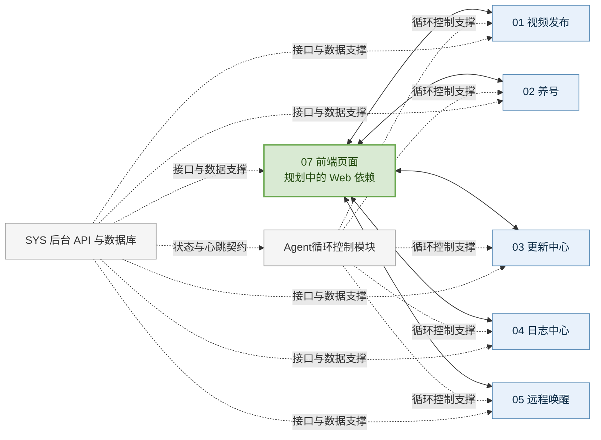
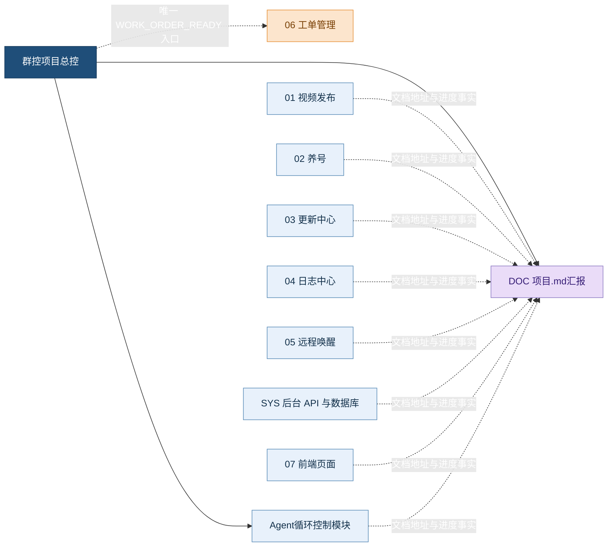

# 群控项目对话关系图

> 这是群控项目的对话协作设计图，适用于 Obsidian 的 Mermaid 预览。
>
> `07 前端页面` 当前只登记为待创建节点，不代表已经创建了新的对话。

## 一、总控树

```mermaid
flowchart TD
    ROOT[群控项目总控<br/>当前对话]

    ROOT --> V01[01 视频发布]
    ROOT --> W02[02 养号]
    ROOT --> U03[03 更新中心]
    ROOT --> L04[04 日志中心]
    ROOT --> R05[05 远程唤醒]
    ROOT --> AGENT[Agent循环控制模块]
    ROOT --> SYS[SYS 后台 API 与数据库]
    ROOT --> DOC[DOC 项目.md汇报]
    ROOT --> WO06[06 工单管理]
    ROOT --> F07[07 前端页面<br/>待创建]

    V01 --> V01A[通过接口发布]
    V01 --> V01B[粘贴发布]

    W02 --> W02A[目标直播间互动养号]
    ROOT -. 历史登记 .-> W02B[刷视频<br/>独立 video 任务]
    W02 --> W02C[抓取评论词<br/>待用户手动真机验收]

    U03 --> U03A[APK 更新]
    U03 --> U03B[biz-scripts 更新]

    L04 --> L04A[手机运行日志]
    L04 --> L04B[后台任务日志]
    L04 --> L04C[问题定位与日志整理]

    R05 --> R05A[设备唤醒]
    R05 --> R05B[任务唤醒]
    R05 --> R05C[远程控制状态]

    SYS --> SYSA[API 接口]
    SYS --> SYSB[数据库]
    SYS --> SYSC[任务与设备命令契约]

    classDef root fill:#1f4e79,color:#fff,stroke:#163a5c,stroke-width:2px;
    classDef business fill:#e8f1fb,color:#12304a,stroke:#5b8db8;
    classDef support fill:#f5f5f5,color:#333,stroke:#999;
    classDef pending fill:#fff2cc,color:#6b4f00,stroke:#c9a227,stroke-dasharray:5 5;

    class ROOT root;
    class V01,W02,U03,L04,R05 business;
    class SYS,DOC,WO06 support;
    class AGENT support;
    class F07 pending;
```

## 二、前端控制关系

`07 前端页面`是统一的业务操作入口和状态展示层，需要与业务模块建立双向联系。

## 三、文档与工单关系

## 四、节点职责

| 节点 | 职责 | 与前端页面关系 | 与工单关系 |
| --- | --- | --- | --- |
| 群控项目总控 | 需求讨论、方案收敛、模块分发、跨模块协调、最终汇总 | 总体控制 | 接收各模块结果后决定是否生成工单 |
| 01 视频发布 | 通过接口发布、粘贴发布 | 规划中的 Web 设计/代码依赖 | 完成后回报总控 |
| 02 养号 | 目标直播间互动养号、抓取评论词；刷视频为历史独立 video 登记 | 规划中的 Web 设计/代码依赖 | 完成后回报总控 |
| 03 更新中心 | APK 与受限 biz-scripts 发布 | 规划中的 Web 设计/代码依赖 | 完成后回报总控 |
| 04 日志中心 | runtime_logs、device_log_files、任务状态与异常排查 | 规划中的 Web 设计/代码依赖 | 完成后回报总控 |
| 05 远程唤醒 | 设备/任务唤醒、统一恢复会话与终态 ACK | 规划中的 Web 设计/代码依赖 | 完成后回报总控 |
| Agent循环控制模块 | 内外循环、状态机、心跳、暂停恢复、重试退出和循环安全门禁 | 提供循环状态支撑，不直接实现页面 | 完成后回报总控 |
| SYS 后台 API 与数据库 | 认证、任务/设备、命令、心跳、日志、结果和数据存储 | 提供接口和数据支撑 | 完成后回报总控 |
| DOC 项目.md汇报 | Markdown 地址索引、内容整理、项目汇报 | 不参与前端业务控制 | 不接收工单关联 |
| 06 工单管理 | 汇总完整变更并生成可复制工单 | 不负责业务页面实现 | 只接收总控的 `[WORK_ORDER_READY]` |
| 07 前端页面 | 统一业务控制入口、状态展示、结果确认；当前为 planned | 表示与 01-05 的设计/代码依赖 | 完成后回报总控 |

## 五、边界说明

- `07 前端页面`与 `01-05` 的连线表示规划中的 Web 设计/代码依赖，不表示已创建 active 对话。
- 工单链路固定为“业务/支撑模块 → 总控 → 06 工单管理”，只有总控发送 `[WORK_ORDER_READY]`。
- `SYS`是共享接口和数据基础，不替代业务模块对话。
- `DOC`只整理 Markdown 文档，不修改业务代码。
- `06 工单管理`只生成工单，不实现代码、不代替测试、不代替用户真机验收。
- `07 前端页面`的实际对话 threadId 待用户确认创建后再补充。
- 所有模块的最终真机验收仍由用户手动完成。
