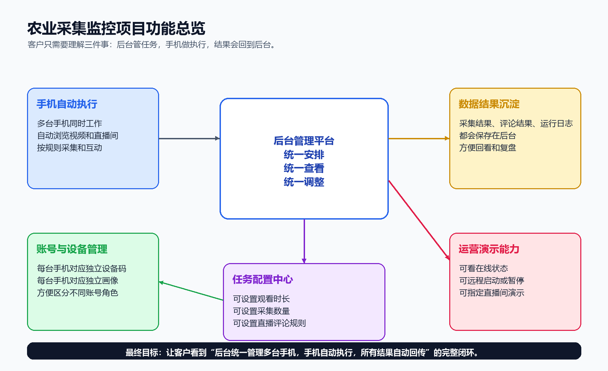
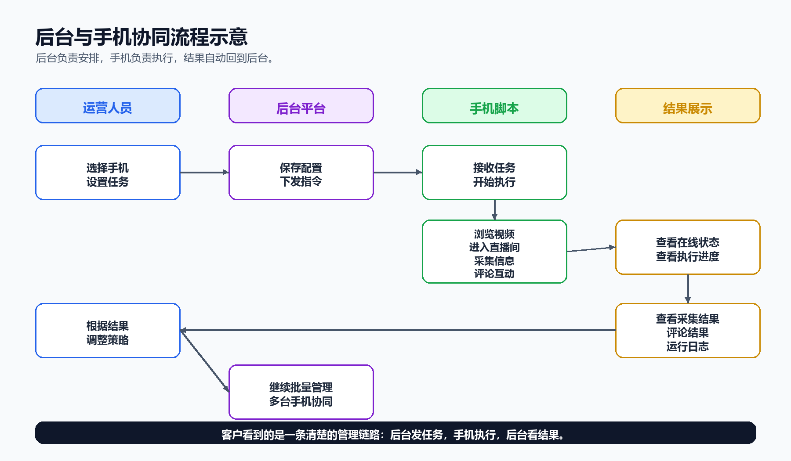

# 2026-06-17_项目功能客户说明与示意图

## 1. 项目功能总览

客户只需要理解三件事：后台管任务，手机做执行，结果会回到后台。

## 2. 后台与手机协同流程

后台负责安排，手机负责执行，结果自动回到后台。客户看到的是一条清楚的管理链路：后台发任务，手机执行，后台看结果。

## 3. 客户能看到的核心功能

1. 查看所有手机的在线状态。
2. 给单台手机设置任务。
3. 批量控制多台手机。
4. 给手机设置账号画像。
5. 给直播评论设置指定直播间。
6. 查看采集结果、评论结果和运行日志。

## 4. 客户演示顺序

1. 打开后台。
2. 找到目标手机。
3. 设置任务和画像。
4. 设置指定直播间。
5. 启动手机执行。
6. 查看执行结果。

## 5. 项目说明

1. 每台手机都有自己的设备码。
2. 每台手机都有自己的账号画像。
3. 后台可以统一管理多台手机。
4. 手机负责自动执行，不需要人工一直盯着。
5. 采集和直播评论的结果都会回到后台。
6. 客户看到的是业务效果，不需要理解内部技术细节。
