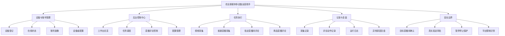

# 产品功能结构与完成度

更新时间：2026-07-08

本文只描述产品功能和业务状态。

## 产品定位

本项目是面向农业新媒体多手机运营测试的后台控制与手机执行系统。核心目标是让运营人员可以在后台统一查看多台手机状态，远程启动视频采集、直播采集和直播评论任务，并通过采集记录、评论记录和运行日志判断每台手机实际执行到了哪一步、为什么成功或失败。

当前项目处于测试联调阶段，重点不是扩大设备规模，而是先把三类任务的启动、暂停、恢复、停止、记录留痕和异常排查链路跑通。

## 业务结构图

## 功能完成度总览

| 一级功能 | 二级功能 | 状态 | 说明 |
|---|---|---|---|
| 设备与账号管理 | 设备登记与身份绑定 | 已完成 | 支持把测试手机纳入后台管理，并区分不同手机。 |
| 设备与账号管理 | 在线状态与最近心跳 | 已完成 | 后台可以看到手机是否在线、是否在执行任务。 |
| 设备与账号管理 | 账号画像 | 已完成 | 直播评论可以按设备维护账号定位、评论风格和话术分组。 |
| 设备与账号管理 | 设备级配置覆盖 | 已完成 | 单台手机可以使用独立任务配置，不必全部跟随公共配置。 |
| 后台控制中心 | 工作台总览 | 已完成 | 支持查看设备、在线状态、当前任务、最近动态和常用控制。 |
| 后台控制中心 | 任务调度 | 已完成 | 支持给手机分配视频、直播、直播评论等任务。 |
| 后台控制中心 | 启动、暂停、恢复、停止 | 联调中 | 后台按钮和手机执行链路已具备，暂停和停止是否立即生效仍需三机继续对账。 |
| 后台控制中心 | 配置管理 | 已完成 | 支持公共任务模板和设备独立配置。 |
| 视频采集 | 推荐视频浏览与内容记录 | 已完成 | 支持手机执行视频浏览任务，并回传采集记录和运行动态。 |
| 视频采集 | 关键词命中记录 | 已完成 | 支持围绕农业相关关键词识别和记录候选内容。 |
| 普通直播采集 | 直播入口识别与进入 | 已完成 | 支持进入公开直播间并停留观察。 |
| 普通直播采集 | 直播内容采样 | 已完成 | 支持记录直播标题、主播、可见内容和公开评论等信息。 |
| 直播评论 | 后台直播评论页 | 已完成 | 支持查看设备评论状态、目标直播间配置和评论动作记录。 |
| 直播评论 | 按关键词搜索目标直播间 | 联调中 | 已改为后台维护搜索关键词和匹配关键词，但搜索输入失败、结果为空和网络异常仍需继续验证。 |
| 直播评论 | 直播中用户入口识别 | 联调中 | 已支持搜索结果中的直播中用户行、直播标识卡片和普通直播卡片，首个直播中用户入口仍需真机稳定性验证。 |
| 直播评论 | 目标直播间确认 | 联调中 | 已要求进房后确认目标关键词，防止误入非目标直播间，但仍需三台手机回归验证。 |
| 直播评论 | 话术池循环评论 | 联调中 | 已恢复按任务时长多轮采样，并从话术数组中取评论内容，仍需确认真实直播间里能持续发出多条。 |
| 直播评论 | 评论动作留痕 | 已完成 | 已记录计划、跳过、失败和发送结果，便于复盘每次评论为什么执行或未执行。 |
| 直播评论 | 真实发送审批 | 已完成 | 真实评论需要明确开启并人工确认，默认不直接发送。 |
| 直播评论 | 账号发言限制识别 | 待建设 | 目前能从现象判断发言受限，但还需要形成明确的后台提示和处置流程。 |
| 商品直播评论 | 商品关键词搜索 | 联调中 | 已具备按商品关键词进入商品直播的业务入口，仍需真机回归。 |
| 商品直播评论 | 商品与直播间匹配 | 联调中 | 已按商品关键词和直播信号做匹配，卡片识别稳定性仍需验证。 |
| 商品直播评论 | 随机评论与观看停留 | 联调中 | 已具备随机评论和停留观看流程，真实发送仍受审批和账号状态限制。 |
| 记录与复盘 | 采集记录 | 已完成 | 支持按手机、日期、明细查看采集结果。 |
| 记录与复盘 | 日志中心 | 已完成 | 支持按手机和日期查看运行动态、异常汇总和完整日志。 |
| 记录与复盘 | 命令回执 | 已完成 | 后台可以看到任务命令是否被手机接收和处理。 |
| 记录与复盘 | 正式证据归档 | 待建设 | 真机截图、录屏和关键日志样本还需要按验收口径补齐。 |

## 已完成能力

| 模块 | 已完成内容 |
|---|---|
| 后台总览 | 设备状态、当前任务、最近心跳、最近日志和常用控制入口已形成。 |
| 任务调度 | 后台可以给设备下发视频、直播、直播评论任务，并查看执行结果。 |
| 视频采集 | 手机可以执行视频浏览采集，并把过程和结果回传后台。 |
| 普通直播采集 | 手机可以进入公开直播间，停留观察并记录直播内容。 |
| 直播评论配置 | 可以维护账号画像、目标直播间搜索关键词、直播间匹配关键词和话术池。 |
| 直播评论记录 | 每次评论计划、跳过、失败、发送都会形成动作记录。 |
| 真实评论保护 | 默认不真实发送评论，必须明确开启并人工确认。 |
| 日志排查 | 后台可以按设备和日期查看运行过程、异常汇总和完整日志。 |
| 商品直播评论 | 已具备商品关键词搜索、商品直播匹配、随机评论和观看停留的基础链路。 |

## 未完成与待闭环功能

| 优先级 | 功能点 | 当前影响 | 下一步目标 |
|---|---|---|---|
| P0 | 直播评论暂停和停止 | 后台显示暂停或停止后，手机可能仍在搜索、滑动或进房。 | 确认暂停和停止在三台手机上都能立即中断当前直播评论链路。 |
| P0 | 搜索关键词输入稳定性 | 直播评论任务可能停在搜索页，无法进入目标直播间。 | 搜索失败时给出明确失败原因，并避免继续误操作。 |
| P0 | 误跳无障碍设置 | 任务过程中可能跳到系统设置页，导致任务中断。 | 只在启动前权限异常时提醒处理，任务执行中不应误跳系统设置。 |
| P0 | 指定直播间防误入 | 真实评论如果进入错误直播间，风险最高。 | 目标主播、标题、画面关键词和直播入口都确认后才允许评论。 |
| P0 | 三机完整回归 | 当前核心链路仍缺少稳定的三台手机连续验证。 | 从后台直播评论页启动任务，验证搜索、进房、评论、停止、退出全链路。 |
| P0 | 商品直播评论真机回归 | 商品卡片和商品直播入口在真机上可能表现不一致。 | 确认能稳定找到目标商品直播，并在审批后按规则评论。 |
| P1 | 搜索空白和网络异常 | 搜索页空白或加载失败时可能等待过久。 | 增加明确的失败状态、重试上限和后台提示。 |
| P1 | 弹窗处理 | 平台弹窗、键盘、权限提示可能挡住任务流程。 | 形成可解释的关闭、暂停或失败策略。 |
| P1 | 多设备调度复盘 | 多台手机同时执行时，失败原因还需要更容易对账。 | 让后台能更直观区分每台手机的任务阶段和失败节点。 |
| P2 | 验收证据归档 | 后续复查缺少统一证据入口。 | 补齐截图、录屏、关键日志和验收结论。 |

## 当前不做的功能

| 功能 | 状态说明 |
|---|---|
| 绕过验证码、登录校验或平台风控 | 不做。 |
| 采集非公开内容 | 不做。 |
| 默认点赞、关注、私信等真实互动 | 不做。 |
| 自动购买、加购或支付 | 不做。 |
| 承诺流量、账号权重或推荐结果 | 不做。 |
| 短视频自动发布 | 当前不做，后续如要恢复需要单独立项。 |

## 当前测试主线

1. 后台确认三台手机在线，并确认账号画像和目标直播间关键词已保存。
2. 从后台直播评论页直接启动直播评论任务。
3. 手机进入抖音后完成搜索、进入目标直播间、确认目标、按话术池评论。
4. 后台能看到评论计划、跳过、失败或发送记录。
5. 点击暂停或停止后，手机立即停止当前直播评论动作，并回到待命状态。
6. 切换到视频任务和普通直播任务后，旧任务不继续搜索、滑动或评论。

## 产品验收口径

| 验收项 | 通过标准 |
|---|---|
| 设备状态 | 后台能准确显示每台手机在线、离线、执行中或待命。 |
| 任务控制 | 启动、暂停、恢复、停止的后台状态和手机实际动作一致。 |
| 视频采集 | 能完成视频浏览，并形成采集记录和运行日志。 |
| 普通直播采集 | 能进入公开直播间，停留采样并形成记录。 |
| 指定直播间评论 | 能通过关键词找到目标直播间，确认后按话术池多次评论。 |
| 真实发送保护 | 未审批时不真实发送，审批后仍必须确认目标直播间。 |
| 异常复盘 | 失败时能说明是未搜到、输入失败、进房失败、账号受限、平台弹窗还是任务被停止。 |
| 任务切换 | 视频、直播、直播评论互相切换时，旧任务不残留动作。 |
