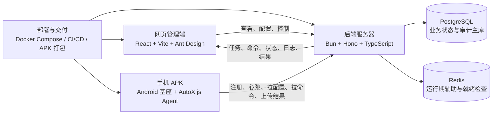
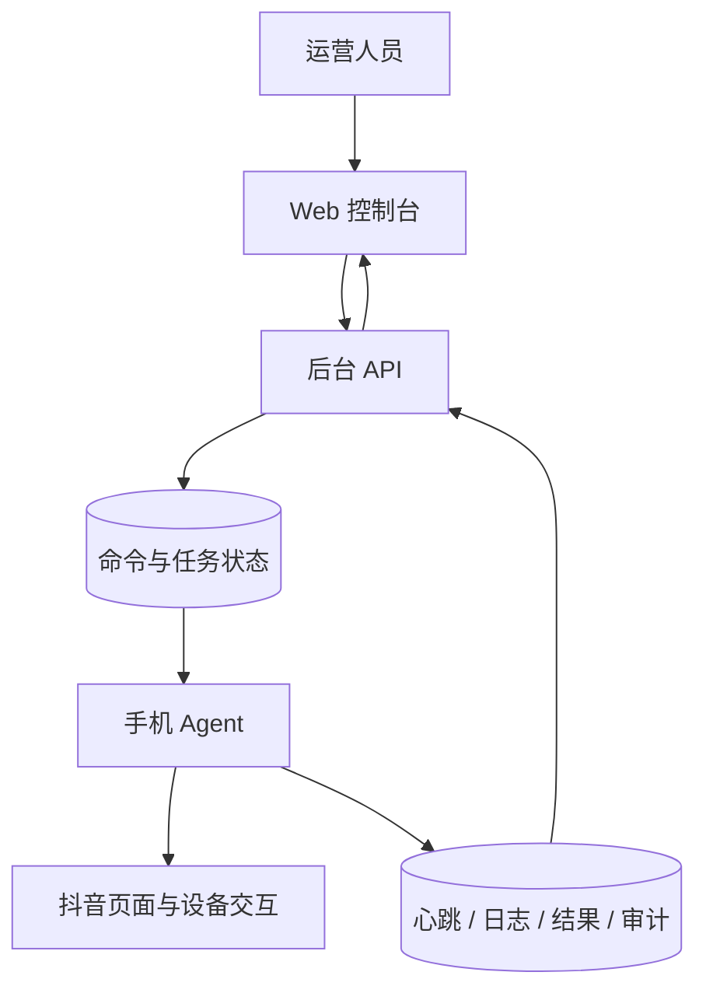
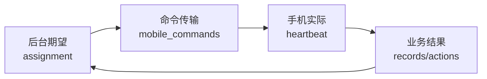

# 群控项目详细介绍

> 文档用途：项目汇报、团队交接和联调说明。  
> 项目名称：Auto Collection（对外可简称“群控项目”）  
> 文档基线：2026-09-01，当前分支 `refactor/comment-capture-isolation-20260826`，代码提交 `fa7704c2fcb7d8ae3d9a827e28a4a70808f64e14`；工作区另有未闭环的评论词专用点击与诊断日志改动，详见项目记录和卡点记录。  
> 说明：本文按业务模块和系统边界编写，不展开到文件、函数或代码行；“已实现”表示代码或后台契约已经具备，“联调中/待验收”表示仍需当前环境或真机验证。

## 1. 项目概述

群控项目是一套面向农业新媒体场景的多设备自动化管理系统。它通过手机 APK 在 Android 设备上运行 AutoX.js Agent，通过网页管理端集中查看设备、配置任务、下发控制命令、查看采集结果和排查日志，后端服务器负责认证、任务与命令编排、数据落库和审计。

项目当前的重点是小范围真机联调和可观测性，而不是一次性扩展到大规模设备集群。系统要能够回答四个问题：每台手机是否在线、正在执行什么、执行结果是什么、失败后能否定位和恢复。

### 1.1 项目定位

| 项目 | 定位 |
| --- | --- |
| 产品形态 | 手机 APK + 网页管理端 + 后端服务器 + 数据库/运行基础设施 |
| 业务对象 | Android 手机、抖音公开视频/直播内容、任务、评论候选、运行日志和发布任务 |
| 核心价值 | 集中控制、任务切换、状态可见、结果留痕、问题可追溯 |
| 当前阶段 | 小规模真实设备联调、功能逐步收敛、以人工可介入和可回退为前提 |
| 非目标 | 不接入抖音官方 API，不绕过验证码、登录校验或平台风控，不采集非公开内容 |

### 1.2 项目目标

1. 让手机 Agent 长时间稳定运行，完成设备注册、配置同步、心跳、命令轮询、日志上传和结果回传。
2. 让运营人员在网页上集中管理设备、任务、直播目标、评论配置、版本和异常。
3. 让视频采集、普通直播观察、目标直播间评论和商品卡直播评论能够被区分、切换和审计。
4. 让任务从“后台期望状态”到“手机实际状态”形成可对账链路，停止、断联和恢复都有明确终态。
5. 让业务脚本更新、APK 基座更新和远程配置更新各自保持清晰边界，出现问题可以回滚。

## 2. 系统组成

项目由两个客户端和一个后端平台组成，数据库、缓存、部署和交付工具为平台提供支撑。



### 2.1 手机 APK 客户端

手机 APK 是真实设备上的执行面，包含 Android 原生基座和 AutoX.js/CommonJS 业务脚本两部分。

- **Android 原生基座**：负责前台连接服务、开机启动、设备身份持久化、原生命令轮询、底座心跳、屏幕解锁、退出抖音、返回 Agent 首页、清理任务卡和锁屏等设备级动作。
- **AutoX.js Agent**：负责权限检查、悬浮窗、无障碍、截图/OCR、抖音页面识别、任务执行、状态恢复、日志和业务结果上报。
- **常驻运行模型**：Agent 常驻并周期性同步后台；业务任务可以启动、暂停、恢复或停止，但业务停止不等于立即杀掉整个 Agent 进程。

### 2.2 网页管理端

网页管理端是运营和排查入口，不直接操作手机屏幕，也不持有业务主状态。它通过后台 API 完成查询、保存配置和创建命令。

当前一级菜单以五个工作入口为主：

1. **视频发布**：管理粘贴发布、接口发布、定时发布、发布设置和设备账号匹配。
2. **养号**：管理目标直播间互动养号、视频养号和抓取评论词。
3. **更新中心**：分别管理业务脚本更新和 APK 基座版本。
4. **日志中心**：按设备、日期和日志视角查看功能状态、异常汇总与完整日志。
5. **远程唤醒**：查看基座和 Agent 可达性，执行启动、唤醒、退出和恢复操作。

任务调度、配置、远程脚本和发布任务等旧页面代码仍保留，但部分入口按当前产品收敛策略隐藏或冻结；它们不能被理解为当前一级菜单，也不能替代现行主流程。

### 2.3 后端服务器

后端位于 `account-data-platform` 工作区，使用 Bun、Hono 和 TypeScript。它是所有客户端之间的协调层，主要负责：

- 管理员登录和移动端设备认证；
- 合并公共任务模板与设备级覆盖配置；
- 生成、领取、确认、过期和取消移动端命令；
- 记录后台期望任务、手机实际任务、心跳、日志、采集结果和评论动作；
- 提供版本、远程脚本、发布任务、设备恢复和远程唤醒接口；
- 在启动时同步远程脚本定义，并启动发布调度器、状态 Outbox worker 和接口发布 worker。

### 2.4 数据库与运行基础设施

- **PostgreSQL** 是业务状态和审计的主存储，保存设备、配置、命令、任务分配、心跳、日志、采集记录、评论动作、版本和发布链路数据。
- **Redis** 由生产 Compose 提供，当前主要用于运行期辅助和 `/ready` 就绪检查；目前没有证据表明它承载了核心业务队列、缓存或审计主状态。
- **Docker Compose** 编排 API、Web、PostgreSQL 和 Redis。生产环境默认让数据库和 Redis 只在容器网络内可见，Web 通过反向代理提供访问。
- **CI/CD 与脚本** 负责质量检查、镜像构建、远程部署、APK 签名打包、业务脚本打包和版本发布。

## 3. 总体架构与职责边界



| 组件 | 负责什么 | 明确不负责什么 |
| --- | --- | --- |
| 手机 Agent | 页面识别、设备交互、任务执行、状态和证据上报 | 不决定多设备调度策略，不绕过平台安全机制 |
| 后台 API | 认证、配置合并、命令队列、状态对账、数据查询和审计 | 不直接控制手机屏幕 |
| Web 管理端 | 展示设备和任务、保存配置、触发命令、查看日志和结果 | 不保存业务主状态，不绕过 API 写库 |
| PostgreSQL | 保存业务事实、运行状态和审计记录 | 不承担 APK 构建或静态文件分发 |
| Redis | 运行期辅助、健康检查和后续扩展预留 | 不替代 PostgreSQL 的业务事实和审计 |
| 部署工具 | 构建、发布、部署、健康检查和回退 | 不改变业务状态机语义 |

## 4. 手机端功能模块

### 4.1 设备身份与运行基础

手机首次运行时生成并持久化设备 token，并派生唯一设备 ID。普通移动端接口必须携带设备 ID 和设备 token；生产环境还可以要求时间戳、请求体摘要和 HMAC 签名。未注册、token 不匹配或签名无效的设备不能访问普通移动端接口。

运行前需要满足无障碍、悬浮窗、截图和网络等条件。Agent 会将结构化运行日志、完整日志文件、心跳和任务结果持续回传，手机本地同时保留按日期组织的日志、候选记录、截图和页面 XML。

### 4.2 常驻控制循环

控制循环是手机端的常驻协调器，负责：

1. 周期性拉取远程配置和待执行命令；
2. 对命令做领取、优先级处理和 ACK，停止类命令拥有更高优先级；
3. 把后台命令转换成任务调度器的启动、暂停、恢复、停止或刷新动作；
4. 在任务运行、切换、等待和退出阶段持续检查停止信号；
5. 按节流策略上报心跳、日志、运行结果和异常上下文。

命令通道和业务状态严格分离：命令表只说明“命令传输到哪一步”，心跳说明“手机此刻实际在做什么”，业务结果表说明“任务最终产生了什么结果”。

### 4.3 任务调度与上下文恢复

任务调度器维护同一设备上的当前任务和切换状态，避免多个前台任务同时操作抖音。任务启动前不假设手机一定在首页，而是先由页面识别器和恢复路由器把设备带回目标上下文。

主要标准上下文包括：

- `feed_context`：普通推荐流或直播发现入口；
- `video_playback_context`：视频播放和滑动采集上下文；
- `search_input_context`：可输入搜索关键词；
- `search_result_context`：已进入指定关键词的结果页；
- `target_live_room_context`：已经确认目标直播间；
- `live_comment_ready_context`：直播间内可进行评论输入或发送；
- `commerce_card_live_context`：从商城商品卡链路进入商品直播的上下文。

页面识别失败、未知弹窗、验证码、登录异常或网络异常时，系统优先记录证据并进入暂停、阻断或等待人工处理状态，而不是盲目继续点击。

### 4.4 视频采集任务

`video` 任务面向公开短视频内容，主要流程是：

1. 进入推荐流或搜索结果；
2. 通过页面文本、OCR 和关键词规则判断内容是否与农业主题相关；
3. 采集标题、作者、来源、关键词、屏幕文本和公开评论等候选信息；
4. 形成采集记录或候选记录并上传后台；
5. 根据任务切换和停止命令安全退出或切换上下文。

该任务是观察和采集链路，不以点赞、关注、私信或其他真实互动为默认行为。

### 4.5 普通直播观察任务

`live` 任务用于发现和观察普通直播：识别直播入口、评估候选、进入直播间、读取公开信号、按配置停留并采样内容。它与目标直播评论任务是两条不同的执行链：普通直播任务不应因为评论配置存在而自动切换到评论 runner，也不负责默认发送评论。

直播入口、人数、关键词和页面状态都可能受到抖音 UI 或 OCR 变化影响，因此任务会保留候选、识别置信度、失败原因和上下文证据，供后台排查。

### 4.6 搜索直播间评论任务

`live_comment` 是独立的目标直播间任务，典型流程为：

```text
后台配置目标
  -> 手机搜索目标账号/关键词
  -> 识别直播入口并进入
  -> 校验主播、标题、房间或页面信号
  -> 读取公开评论/生成评论计划
  -> 按门禁发送、跳过或失败
  -> 回传动作和审计证据
```

真实发送必须同时满足目标直播间确认、真实发送开关、次数和间隔限制、敏感词/风险规则及必要的人工审批。计划、跳过、失败和发送都写入 `live_comment_actions`，不能只以手机页面显示“点击成功”作为业务成功依据。

### 4.7 商品卡直播评论组合任务

`commerce_card_live_comment` 是从商城商品卡出发的组合任务，不等同于搜索直播间评论。它通常经历：

1. 搜索商品关键词；
2. 浏览商品卡、商品详情或推荐商品；
3. 识别商品卡关联的直播信号；
4. 进入并确认目标直播间；
5. 按组合任务阶段执行观看、评论或养号动作；
6. 使用 checkpoint、配置快照、事件序号和幂等键记录进度。

后台已经具备较完整的 assignment、配置版本/hash、能力门禁、灰度名单、审批额度、评论副作用预留/结算和撤销基础能力。商品卡 V2 的后台与协议基础已落地，但设备端真实链路仍以当前联调和验收记录为准，不能笼统描述为全量生产闭环。

### 4.8 养号与评论词抓取

养号模块包含目标直播间互动养号、视频养号和抓取评论词三个入口。互动动作受配置、频率、风险和审计门禁控制；抓取评论词流程重点是采集公开评论文本，而不是自动执行评论互动。

当前评论词链路为：

```text
手机进入目标直播间并筛选房间
  -> OCR 分页提取历史评论
  -> 文本清洗、噪声过滤、跨页去重
  -> 按批次和规范化正文幂等回传候选
  -> 后台待入库列表
  -> 人工勾选确认
  -> 写入共享评论词库
```

该流程已经具备候选表、来源信息、确认入库和重复确认幂等能力；部分记录仍要求覆盖安装 APK 后进行真机端到端验收。

### 4.9 视频发布扩展

视频发布是当前网页可见的重要业务模块，但它与“采集主线”在职责上分开。手机端发布扩展支持抖音/视频号素材准备、封面和话题校验、UI 发布、设备账号路由、同设备串行锁、看门狗、结果回传和发布后清理；后台支持发布任务、设备账号绑定、接口领取、槽位容量、时段、监控和外部状态回写。

发布能力应按扩展链路理解，是否可在目标设备和当前账号上稳定完成，仍需结合真机验收记录，不应与视频/直播采集任务混写成同一 runner。

### 4.10 远程唤醒与设备恢复

远程唤醒用于处理 Agent 未运行、应用在后台、设备锁屏或基座连接异常等情况。网页先展示基座可达性、Agent 可达性、屏幕锁定和应用前后台状态，再按恢复阶段执行启动 Agent、打开应用、退出残留进程、清理任务卡和回到标准入口。

基座命令通道与 Agent 命令通道分离；后台保存恢复 session、阶段、错误、超时和事件审计。恢复失败时优先留下可读的阶段和错误原因，而不是把设备简单标记为“在线”。

## 5. 网页管理端功能模块

### 5.1 工作台与设备概览

工作台以设备为中心，展示在线状态、当前任务、今日进度、功能状态和最近日志。核心状态面向运营人员使用中文和人话表达，复杂 JSON、命令 payload 和完整日志放到详情抽屉或日志中心。

设备详情通常可以触发启动、暂停、恢复、停止和刷新配置，并查看最近心跳、任务状态、日志和采集结果。

### 5.2 视频发布页面

视频发布页面由多个业务视图组成：任务看板、粘贴发布、接口发布、接口定时、发布设置和设备账号。它负责把素材校验、账号路由、设备串行、发布回执和外部状态回写组织成可操作流程。

接口发布还涉及运行时段、账号槽位、并发容量、预留、告警和人工处置，后台记录的是发布任务和运行审计，不是简单的“点击发布”按钮。

### 5.3 养号页面

养号页面把目标直播间互动养号、视频养号和抓取评论词区分开。抓取评论词的后台视图展示候选来源、批次、设备、房间和待入库/已入库状态；人工确认后才进入共享词库。

搜索直播间评论和商品卡直播评论需要通过任务类型、配置字段和日志阶段区分，避免在页面上被混成一个笼统的“直播评论”。

### 5.4 更新中心

更新中心有三条不同概念的更新边界：

| 更新边界 | 覆盖范围 | 是否需要重打 APK |
| --- | --- | --- |
| 远程脚本配置 | 参数、开关、设备绑定、revision/configHash | 否 |
| `biz-scripts` 业务脚本包 | 受白名单保护的 `features/` 与 `domain/` | 否 |
| APK 基座 | `app/`、`core/`、`platforms/`、`utils/`、原生库、入口和资源 | 是 |

业务脚本页面负责构建、发布、版本历史、逐文件 SHA-256 和设备生效状态；APK 基座页面按 `stable`、`gray`、`dev` 通道展示版本、包地址、校验值、发布说明和设备统计。业务脚本发布不会构建或安装 APK，`config.js` 也不进入业务脚本热更新包。

### 5.5 日志中心

日志中心采用“设备 -> 日期 -> 视角”的三层路径：

1. **功能状态**：面向运营人员，显示发生了什么、处于哪个环节、是否影响任务和建议处理方式；
2. **异常汇总**：聚合 WARN、ERROR、最近失败原因和设备影响范围；
3. **完整日志**：展示手机上传的完整日志文件、上传时间、文件大小、警告数、错误数和最近错误。

后台同时保留结构化 `runtime_logs` 和完整 `device_log_files`。前者用于筛选和统计，后者用于还原脚本现场；两者通过设备、日期、任务和命令信息互相对账。

### 5.6 远程唤醒页面

远程唤醒页面把“设备是否在线”和“Agent 是否可执行”区分开，支持查看基座接入、屏幕锁定、应用前后台、Agent 生命周期和恢复阶段，并提供启动、打开应用、退出 Agent、清理后台和重试等动作。

## 6. 后端 API 与共享契约

### 6.1 API 分区

后端接口按调用方分成三类：

| API 分区 | 主要能力 |
| --- | --- |
| 管理端 API | 管理员认证、设备与账号、任务模板、设备覆盖配置、任务分配、直播目标、采集/评论/日志查询、版本、远程脚本和发布管理 |
| 移动端 API | 设备注册、Token/HMAC 认证、配置拉取、Agent/基座心跳、命令轮询与 ACK、采集记录、日志、评论动作、版本事件和 assignment 进度 |
| 健康与下载 | `/health`、`/ready`、APK/只读下载和部署健康检查 |

移动端普通请求以设备身份为核心，生产环境可强制时间戳、请求体摘要和 HMAC 签名；管理员接口使用 Bearer 令牌和后台认证策略。

### 6.2 共享契约层

`packages/types` 使用 TypeScript 和 Zod 统一维护前后端及移动端共享契约，覆盖：

- 任务类型、命令类型和命令/回执状态；
- 设备恢复、远程唤醒和 Agent 生命周期；
- 养号、直播目标、评论动作和商品卡工作流；
- 远程脚本、版本渠道、revision/hash 和设备绑定；
- 发布任务、发布路由、接口发布和外部状态回写；
- 幂等键、错误码、checkpoint、能力门禁和审批信息。

共享契约的作用是让 Web 展示、API 校验和手机回执使用同一套状态语义，避免同一个状态在三个端被解释成不同含义。

### 6.3 三种状态不能混写



- **Assignment**：后台希望某台设备执行什么任务，包含阶段、配置快照、版本和 checkpoint。
- **Mobile command**：命令是否待下发、已领取、已确认、失败、过期或取消，只负责传输与回执。
- **Heartbeat**：手机此刻实际运行的任务、页面、进度和 Agent 生命周期。
- **Business result**：采集记录、评论动作、发布回执和候选词等最终业务事实。

典型 assignment 状态流为：

```text
PENDING -> DISPATCHED -> RUNNING
                       -> PAUSED -> RUNNING
                       -> BLOCKED
RUNNING/PAUSED/BLOCKED -> SUCCEEDED / FAILED / CANCELLED / EXPIRED
```

命令显示“已确认”不等于业务已完成；后台必须结合心跳、运行日志和业务结果做最终对账。

## 7. 数据模型与审计体系

数据库按业务职责分层，而不是把所有状态塞进一张任务表。

| 数据域 | 保存内容 | 主要用途 |
| --- | --- | --- |
| 设备身份与状态 | 设备 ID、token、Agent 生命周期、版本、能力、账号画像、在线概况 | 认证、设备管理和状态投影 |
| 配置与目标 | 公共任务模板、设备覆盖、直播目标、别名、特性和设备绑定 | 形成可追溯的运行配置 |
| 命令与分配 | 命令 payload/result、幂等键、过期时间、assignment、阶段事件和 checkpoint | 控制、并发和恢复 |
| 心跳与恢复 | 设备心跳、基座心跳、恢复 session、阶段事件和错误 | 判断实际运行状态和恢复进度 |
| 采集结果 | 视频/直播记录、候选文本、关键词和来源 | 业务结果查询与去重 |
| 评论动作 | 计划、已发送、跳过、失败、房间确认、permit 和证据 | 真实互动审计和风险追溯 |
| 日志 | 结构化运行日志、完整日志文件 | 运营排查和现场还原 |
| 更新与发布 | Agent 版本、更新事件、业务脚本、发布任务、槽位、外部回写 | 交付、状态同步和回滚 |
| 安全与灰度 | allowlist、能力门禁、审批、额度、冷却和撤销 | 控制高风险功能的执行范围 |

### 7.1 可靠性原则

1. 配置使用 revision、configHash 或 snapshotHash 固定运行依据。
2. 命令使用幂等键、领取、过期和取消，避免重复执行。
3. 评论动作使用 side-effect reserve/resolve，避免网络重试造成重复发送。
4. 任务切换和停止保留命令 ID、批次 ID、原因和业务终态。
5. 断联、未知页面、验证码和风险状态优先转为可解释的阻断或人工处理，而不是静默成功。

## 8. 典型端到端流程

### 8.1 设备注册与上线

```text
安装 APK
  -> 生成/读取设备身份
  -> 检查无障碍、悬浮窗、截图和网络
  -> 调用设备注册接口
  -> 后台校验 token/签名并建立设备记录
  -> 周期性上报 Agent/基座心跳
  -> Web 工作台出现在线状态
```

### 8.2 后台下发任务

```text
运营人员在 Web 选择设备和任务
  -> API 校验配置、能力和权限
  -> 写入 assignment 与 mobile_commands
  -> 手机轮询并原子领取命令
  -> ACK 命令传输状态
  -> 调度器中断旧任务并恢复目标上下文
  -> 执行 video/live/live_comment/commerce_card_live_comment
  -> 心跳上报 actualTaskType、阶段和进度
```

### 8.3 采集与结果回传

```text
页面识别/OCR/规则判断
  -> 形成候选或采集记录
  -> 手机写本地日志并上传结构化日志
  -> API 写入 collection_records 或候选表
  -> Web 按设备、日期和内容查看
```

### 8.4 直播评论安全链路

```text
配置目标直播间与发送门禁
  -> 搜索并进入目标
  -> 二次校验主播/房间/页面信号
  -> 生成计划
  -> 检查 allowRealSend、审批、次数、间隔、敏感词和风险状态
  -> sent / skipped / failed
  -> live_comment_actions + runtime_logs + 证据回传
```

### 8.5 更新链路

```text
远程配置变更 -> revision/configHash -> Agent 拉取并 ACK
业务脚本发布 -> features/domain 包 -> 空闲门禁 -> 校验 -> 覆盖层/回滚
APK 基座发布 -> stable/gray/dev -> 签名 APK -> 人工/ADB 安装 -> 版本事件回传
```

### 8.6 停止、断联与恢复

```text
后台 STOP 或设备异常
  -> API 写入停止/恢复命令
  -> 手机优先中断等待、页面动作和上传线程
  -> 回传 STOPPED/FAILED 或 BLOCKED 业务终态
  -> 后台 reconcile 对账 assignment、命令和心跳
  -> 必要时通过基座远程唤醒或 EXIT_AGENT_APP 收口
```

## 9. 部署、开发与交付

### 9.1 本地开发组成

后台工作区使用 Bun workspace：

- `apps/api`：Bun + Hono API；
- `apps/web`：React 19 + Vite + Ant Design 管理端；
- `packages/db`：Drizzle schema、迁移和数据库客户端；
- `packages/types`：共享类型和 Zod 契约。

常用本地服务约定：API `3012`、Web `3022`，PostgreSQL `5432`，Redis `6379`。移动端调试时必须把 APK 内的 API 地址配置为手机可访问的开发机地址或公网地址，不能使用手机不可达的回环地址。

### 9.2 生产部署

生产 Compose 当前按 PostgreSQL 16、Redis 7、API 和 Web 四类服务编排：

- API 在容器内提供服务端口；
- Web 由 Bun 静态服务器提供 SPA，并代理 `/api`、健康检查和只读下载；
- PostgreSQL/Redis 使用持久卷并默认只暴露在容器网络；
- 公网通过反向代理或 Cloudflare Tunnel 提供 Web 和手机 API 地址；
- `/ready` 同时检查 PostgreSQL 和 Redis，Redis 故障会使就绪检查失败；
- 数据库 schema 默认不在普通启动时自动 push，生产迁移需要显式执行并记录。

生产部署必须配置 JWT secret、管理员密码、移动端注册密钥、请求签名开关等敏感参数，密码写入连接 URL 时要进行 URL 编码。历史部署说明中存在旧端口、旧服务器目录和旧公网地址，实际操作应以现行 Compose、部署脚本和 CI workflow 为准。

### 9.3 CI/CD 与 APK 交付

CI 通常先执行移动端脚本语法检查和 Node 测试，再执行 Bun lint、typecheck、测试和构建，最后构建 API/Web 镜像并推送到 GHCR。自托管部署任务通过 SSH 同步源码和 Compose，启动数据库与缓存，构建服务并轮询健康检查。

APK 由 Gradle/AutoJs6 工程构建，经过签名、对齐、SHA-256 校验后通过 ADB 覆盖安装。业务脚本包由白名单目录生成 manifest 和逐文件校验值；更新失败时恢复上一覆盖层或继续使用 APK 内置基线。

## 10. 当前能力与阶段状态

下表按当前代码、方案文档、项目记录和验收记录综合判断，避免把“代码存在”与“生产闭环”混为一谈。

| 能力 | 当前判断 | 说明 |
| --- | --- | --- |
| 设备注册、Token/HMAC、心跳和日志上报 | 已实现并持续联调 | 基础接口、状态投影和异常回执已经形成主链路 |
| 视频采集与普通直播观察 | 已具备主流程 | 重点是公开内容观察、候选识别和运行证据回传 |
| 目标直播间评论 | 已具备受控链路 | 目标确认、真实发送开关、限额/间隔和动作审计必须同时满足 |
| 商品卡直播评论 V2 后台基础 | 已落地基础设施 | assignment、快照/hash、checkpoint、审批和幂等能力已具备，真机闭环按验收记录判断 |
| 抓取评论词 | 代码链路已完成，真机验收进行中 | 候选回传、人数筛选、历史评论提取、人工确认入库已接线 |
| 任务切换、暂停、恢复、停止 | 已具备基础能力 | 仍需持续验证页面异常、断联和跨任务竞态 |
| 远程唤醒与统一恢复 | 后台和基座能力已具备 | 复杂设备状态仍需结合现场网络、锁屏和权限验收 |
| 视频发布 | 业务代码已具备，按扩展链路维护 | 发布账号、槽位、外部回写和真机稳定性不能由采集链路推断 |
| 业务脚本热更新 | 已接入更新中心 | 只覆盖 `features/` 与 `domain/`，失败需回滚；不替代 APK 更新 |
| APK 基座更新 | 已接入版本管理和交付 | `stable/gray/dev` 通道需要重新签名、安装和设备验证 |
| 大规模统一编排 | 规划/收敛中 | 当前目标是小范围真机联调，不应宣称已完成大规模集群调度 |
| 全仓库质量门禁 | 以当前复跑结果为准 | 历史记录存在旧夹具、类型检查或全量测试问题，不能写成“全绿” |

## 11. 安全、合规与操作边界

1. 只处理公开可见内容，不采集非公开内容。
2. 不绕过验证码、登录校验、账号风控或平台安全限制。
3. 点赞、关注、私信和真实评论默认关闭；开启时必须有明确范围、频率、审批和审计。
4. 评论真实发送必须确认目标直播间，并经过 `allowRealSend`、permit、次数、间隔、敏感词和风险状态门禁。
5. 出现验证码、风控、登录异常、未知弹窗或关键 OCR 失败时，优先暂停并请求人工处理。
6. 生产密钥、设备 token、签名材料、SSH 凭据和公网入口不得提交到仓库或写入普通日志。
7. 数据库迁移、生产部署、APK 安装和业务脚本发布都应记录提交号、版本、校验值和回退方式。

## 12. 维护重点与已知风险

### 12.1 设备与页面风险

- 抖音 UI、文本布局和 OCR 结果变化会影响直播入口、人数、评论区和商品卡识别；
- 设备锁屏、权限变化、前后台切换和网络抖动会造成“Agent 在线但任务不可执行”；
- 设备身份必须持久化，不能用默认占位 ID 覆盖正式设备；
- 同一设备的前台任务必须互斥，停止和切换要防止旧线程晚到回执覆盖新状态。

### 12.2 后台一致性风险

- assignment、命令、心跳和业务结果需要分开对账；
- 命令过期、重复领取、网络重试和断联恢复必须保持幂等；
- `runtime_logs` 与完整日志文件的上传节流不能影响停止和关键错误回传；
- Redis 当前不是审计主库，不能把缓存可用性当成业务事实。

### 12.3 更新与部署风险

- 业务脚本热更新只能覆盖白名单目录，入口、核心能力和原生库变化必须重打 APK；
- 配置 revision/hash、包文件 SHA-256 和 APK 签名需要在发布与设备生效时分别校验；
- 生产默认跳过 schema push，迁移顺序和备份策略必须由部署人员明确执行；
- 历史部署文档与现行 Compose 存在地址/端口差异，应以现行部署入口为准。

### 12.4 代码维护约束

远程脚本模块的新建或修改 `.js/.ts/.tsx` 文件必须控制在 600 行以内，并尽量保持在 450 行以内。仓库中已经存在的超限存量文件不在本介绍任务中顺手重构，应按项目记录单独立项；这是一项代码治理约束，不代表本次文档对存量文件做了改动。

## 13. 阅读与交接建议

建议按以下顺序理解项目：

1. 先看本文的系统组成、职责边界和三种状态模型；
2. 再看系统架构方案，确认 Web、API、Agent、PostgreSQL 和 Redis 的分工；
3. 进入手机端任务调度与状态恢复方案，理解页面上下文、切换和停止；
4. 按业务需要阅读视频与直播采集、直播评论、商品卡组合任务和视频发布方案；
5. 查看后台监控与日志中心方案，理解运营页面如何展示“发生了什么”；
6. 最后对照项目记录、卡点与问题记录、验收口径和设备联调记录，判断哪些能力已经通过当前环境验证。

关键设计依据包括：

- `docs/方案设计/架构方案/系统架构方案.md`
- `docs/方案设计/功能方案/手机端任务调度与状态恢复方案.md`
- `docs/方案设计/功能方案/视频与直播采集方案.md`
- `docs/方案设计/功能方案/直播评论自动化方案.md`
- `docs/方案设计/功能方案/商品卡养号与直播评论组合任务方案.md`
- `docs/方案设计/功能方案/后台监控与日志中心方案.md`
- `docs/方案设计/功能方案/远程脚本功能模块方案.md`
- `docs/项目开发/项目记录.md`
- `docs/项目开发/卡点与问题记录.md`
- `docs/项目开发/验收口径.md`

## 14. 一句话总结

群控项目不是单一的“手机脚本”，而是一个由手机执行面、网页控制面、后台协调面和数据审计面组成的闭环平台：网页提出目标，API 负责校验和编排，手机在真实设备上执行，数据库记录事实和证据，日志、恢复和更新机制保证系统可观察、可控制、可回退。
