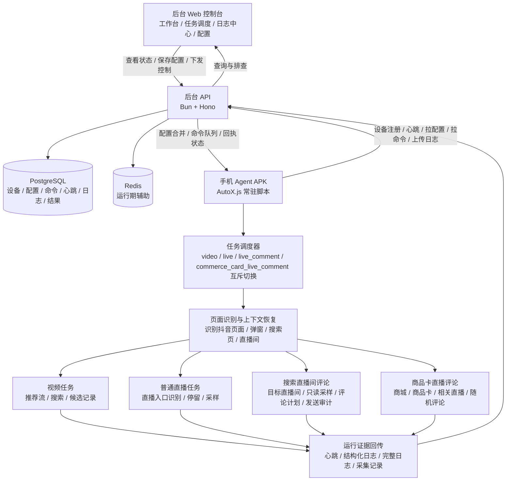
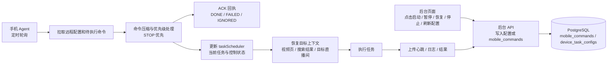
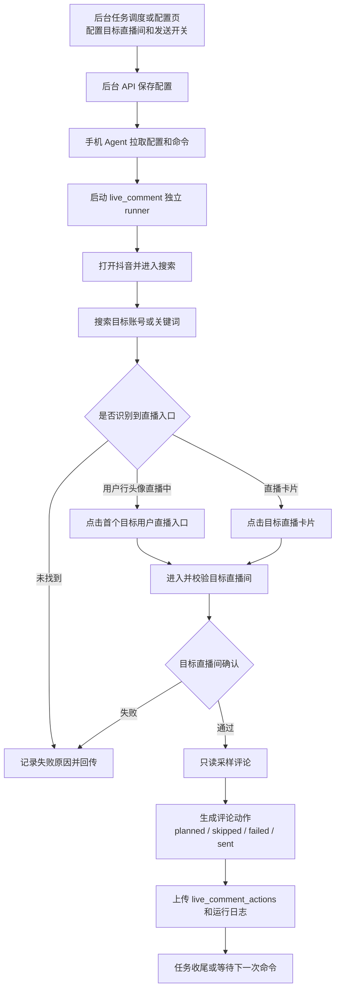

# 项目流程图

更新时间：2026-07-03

本文用于快速说明 Auto Collection 当前主流程。详细方案以 `docs/方案设计/` 和 `docs/项目开发/` 下专题文档为准。

## 1. 总体闭环

```mermaid
flowchart TD
  Web[后台 Web 控制台<br/>工作台 / 任务调度 / 日志中心 / 配置] -->|查看状态 / 保存配置 / 下发控制| API[后台 API<br/>Bun + Hono]
  API --> DB[(PostgreSQL<br/>设备 / 配置 / 命令 / 心跳 / 日志 / 结果)]
  API --> Redis[(Redis<br/>运行期辅助)]

  Agent[手机 Agent APK<br/>AutoX.js 常驻脚本] -->|设备注册 / 心跳 / 拉配置 / 拉命令 / 上传日志| API
  API -->|配置合并 / 命令队列 / 回执状态| Agent

  Agent --> Scheduler[任务调度器<br/>video / live / live_comment / commerce_card_live_comment 互斥切换]
  Scheduler --> Recovery[页面识别与上下文恢复<br/>识别抖音页面 / 弹窗 / 搜索页 / 直播间]

  Recovery --> Video[视频任务<br/>推荐流 / 搜索 / 候选记录]
  Recovery --> Live[普通直播任务<br/>直播入口识别 / 停留 / 采样]
  Recovery --> Comment[搜索直播间评论<br/>目标直播间 / 只读采样 / 评论计划 / 发送审计]
  Recovery --> CommerceComment[商品卡直播评论<br/>商城 / 商品卡 / 相关直播 / 随机评论]

  Video --> Upload[运行证据回传<br/>心跳 / 结构化日志 / 完整日志 / 采集记录]
  Live --> Upload
  Comment --> Upload
  CommerceComment --> Upload
  Upload --> API
  API -->|查询与排查| Web
```

## 2. 后台到手机任务链路

```mermaid
flowchart LR
  A[后台页面<br/>点击启动 / 暂停 / 恢复 / 停止 / 刷新配置] --> B[后台 API<br/>写入配置或 mobile_commands]
  B --> C[(PostgreSQL<br/>mobile_commands / device_task_configs)]
  D[手机 Agent<br/>定时轮询] --> E[拉取远程配置和待执行命令]
  E --> F[命令压缩与优先级处理<br/>STOP 优先]
  F --> G[ACK 回执<br/>DONE / FAILED / IGNORED]
  F --> H[更新 taskScheduler<br/>当前任务与控制状态]
  H --> I[恢复目标上下文<br/>视频页 / 搜索结果 / 目标直播间]
  I --> J[执行任务]
  J --> K[上传心跳 / 日志 / 结果]
  K --> B
```

## 3. 直播评论任务链路

```mermaid
flowchart TD
  A[后台任务调度或配置页<br/>配置目标直播间和发送开关] --> B[后台 API 保存配置]
  B --> C[手机 Agent 拉取配置和命令]
  C --> D[启动 live_comment 独立 runner]
  D --> E[打开抖音并进入搜索]
  E --> F[搜索目标账号或关键词]
  F --> G{是否识别到直播入口}
  G -->|用户行头像直播中| H[点击首个目标用户直播入口]
  G -->|直播卡片| I[点击目标直播卡片]
  G -->|未找到| X[记录失败原因并回传]
  H --> J[进入并校验目标直播间]
  I --> J
  J --> K{目标直播间确认}
  K -->|通过| L[只读采样评论]
  K -->|失败| X
  L --> M[生成评论动作<br/>planned / skipped / failed / sent]
  M --> N[上传 live_comment_actions 和运行日志]
  N --> O[任务收尾或等待下一次命令]
```
