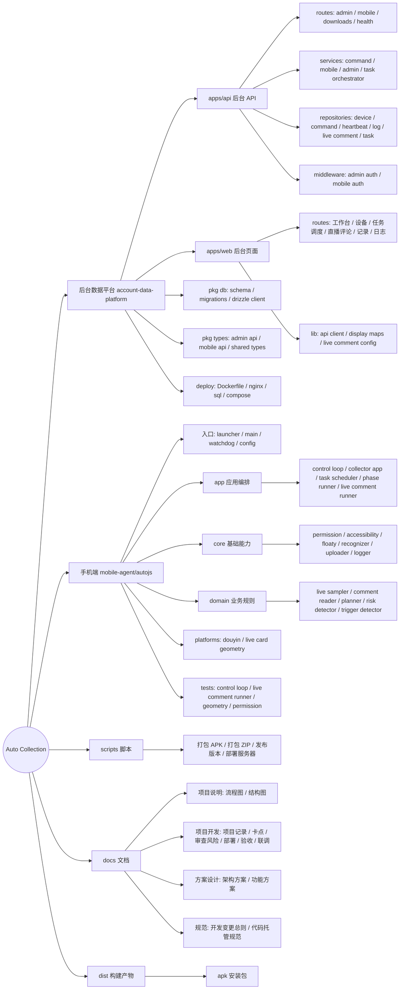

# 项目结构图

更新时间：2026-07-03

本文用思维导图形式说明当前仓库结构和主要职责。

```mermaid
graph LR
  root((Auto Collection))

  root --> backend[后台数据平台 account-data-platform]
  backend --> api[apps/api 后台 API]
  api --> api_routes[routes: admin / mobile / downloads / health]
  api --> api_services[services: command / mobile / admin / task orchestrator]
  api --> api_repos[repositories: device / command / heartbeat / log / live comment / task]
  api --> api_mw[middleware: admin auth / mobile auth]
  backend --> web[apps/web 后台页面]
  web --> web_routes[routes: 工作台 / 设备 / 任务调度 / 直播评论 / 记录 / 日志]
  web --> web_lib[lib: api client / display maps / live comment config]
  backend --> db[pkg db: schema / migrations / drizzle client]
  backend --> types[pkg types: admin api / mobile api / shared types]
  backend --> deploy[deploy: Dockerfile / nginx / sql / compose]

  root --> agent[手机端 mobile-agent/autojs]
  agent --> entry[入口: launcher / main / watchdog / config]
  agent --> app[app 应用编排]
  app --> app_items[control loop / collector app / task scheduler / phase runner / live comment runner]
  agent --> core[core 基础能力]
  core --> core_items[permission / accessibility / floaty / recognizer / uploader / logger]
  agent --> domain[domain 业务规则]
  domain --> domain_items[live sampler / comment reader / planner / risk detector / trigger detector]
  agent --> platforms[platforms: douyin / live card geometry]
  agent --> tests[tests: control loop / live comment runner / geometry / permission]

  root --> scripts[scripts 脚本]
  scripts --> scripts_items[打包 APK / 打包 ZIP / 发布版本 / 部署服务器]

  root --> docs[docs 文档]
  docs --> docs_intro[项目说明: 流程图 / 结构图]
  docs --> docs_dev[项目开发: 项目记录 / 卡点 / 审查风险 / 部署 / 验收 / 联调]
  docs --> docs_design[方案设计: 架构方案 / 功能方案]
  docs --> docs_rules[规范: 开发变更总则 / 代码托管规范]

  root --> dist[dist 构建产物]
  dist --> apk[apk 安装包]
```
